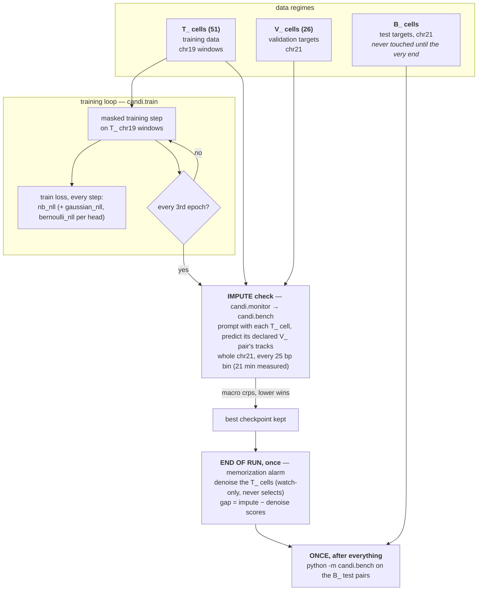
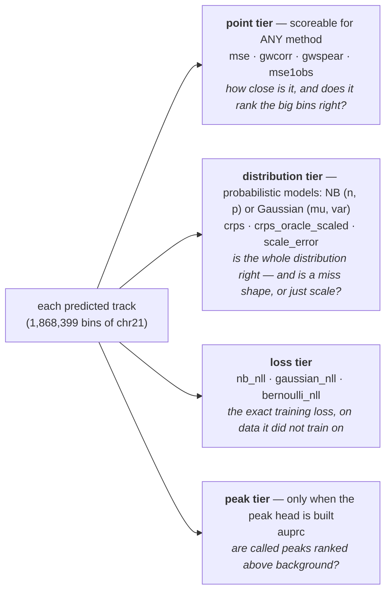
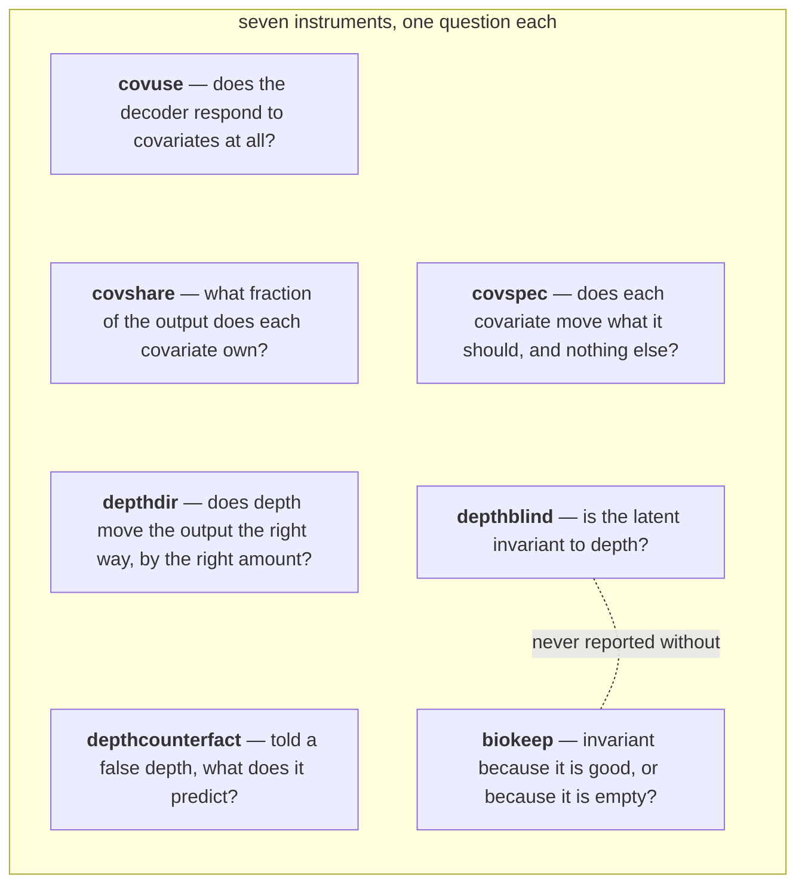

# EVAL.md — the metric contract

Owns: what `candi.bench` and `candi.monitor` measure, the keys they write, and the rules for
quoting a number. Input contract → DATA.md. Invariants, tasks, gates → AGENTS.md. What CANDI is →
README.md.

Source of truth is `src/candi/bench/` (the suite), `src/candi/monitor.py` (the mid-training dial)
and `src/candi/metrics.py` (the numeric primitives). Where this file and the code disagree the code
is right and this file is the bug.

`candi.eval` — the module that owned every number recorded before this repo — is **deleted** (D15).
Nothing imports it, nothing can re-run it. Its output keys are still readable in old result files;
*Reading a pre-bench result file* at the bottom says what they were called.

## The pipeline at a glance

Three pictures, three minutes. Numbers marked *measured* trace to `cruxvault/results/t30/TIMING.md`
(job 56232885, MIG slice).

### The loop: what runs when



### The metrics: what each predicted track is asked



### The covariate diagnostics (bench C block — run on demand, not mid-training)



## Two instruments, and they are not interchangeable

| | `candi.bench` | `candi.monitor` |
|---|---|---|
| when | after a run, as its own command | during a run, every `--eval-every` epochs, plus once at the end |
| what for | the recorded number | choosing a checkpoint |
| coverage | every 25 bp bin of every eval chromosome | the same — no sampling either |
| blocks | E, P, D, B, C, loss | a tiered subset of E + D + loss (+ B when the peak head is built) |
| arms | `count` and `pval` | `count` only, by ruling |
| dials | `impute`; `denoise` on `--kinds` | `impute` per check; `denoise` once, at the end — `impute` is not droppable |
| data | `--h5` or `--store` | `--store` only |

The monitor exists to select, not to publish. A number quoted from a run json's `eval_curve` is a
selection statistic; a number quoted as a result comes from a bench run.

## Scoring a checkpoint is one command

```bash
python -m candi.bench --store <regime.json> --ckpt <run.ckpt> --arch-from <run.json> \
    --out <scores.json>
```

`--h5 <panel.h5>` scores a baked h5 instead. Exactly one of the two is required
(`bench.harness.open_source`). Scale — `num_assays`, `context_bins`, `resolution`, the assay order
and the eval chromosomes — is read from the source, never passed. The architecture comes from
`--arch-from`.

### Always pass `--arch-from`, never retype the architecture

`--arch-from` reads `config.arch` out of the run's own JSON and rebuilds the model that wrote the
checkpoint. Every geometry, norm, FiLM and head flag changes the `state_dict`. A mismatch is a
strict-load failure at best — and at worst a model that loads and is quietly not the one you
trained. `--depth-center` is in `config.arch` and still wins if passed explicitly: it is a property
of the data, not of the architecture.

### The flags that shrank a run unevenly are refused by name

`--eval-budget`, `--max-batches`, `--eval-max-batches` and `--batches-per-pair` all existed on the
old CLI and all raise here with the reason attached (`bench.cli.RETIRED`, D2). The suite scores
every bin; there is no budget to set. On a 38-pair panel `--eval-max-batches 12` scored 12 targets
and dropped 26 without a word — that is what the refusal is for. Choose a smaller panel with
`--biosamples` (store only), or fewer chromosomes with `--chroms`.

**The C-index is the one documented exception** (D3). Concordance is pairwise — 1.7e12 pairs on
chr21 — so it is estimated over `--c-index-pairs` seeded pairs and always ships with `c_index_se`.
A C-index without its SE is not quotable. The C-block is sampled too and says so: `n_units`,
`n_windows`, `n_resamples`, `n_outer`, `n_inner` are all in its output.

## Scoring somebody else's tracks is the same command with no checkpoint

```bash
python -m candi.bench.external --store <regime.json> --pred <pred_root> --out <scores.json> \
    [--chroms chr21,...] [--sigma-table <sigma.json>] [--varpool ...] [--allow-missing] \
    [--crps-approx K --crps-seed S]
```

A rival has no checkpoint we can load, so it hands over the prediction itself, on our grid:
`<pred_root>/manifest.json` plus one directory per track named `<input>__<target>__<assay>` — the
`track_key` below with `|` swapped for `__` — each holding one `chr*.npz` per chromosome, arrays on
the absolute 25 bp bin grid, length exactly `floor(chr_len / 25)`. The recognised arrays are
`signal_mu`, `signal_sigma`, `mu` + `n`, and `peak_score`. `RIVALS_PLAN.md` §4 is the full contract.

Nothing there computes a metric: truth comes from `harness.open_source`, scoring from
`harness.score_track`, the roll-up from `harness.macro_mean`, and the result has `run_bench`'s
shape with `provenance.method` from the manifest. `tests/test_bench_external.py` scores CANDI's own
predictions both ways and requires every shared numeric key to agree — the external path is the
same instrument, proven rather than asserted.

Three things it will not do. It will not resize an array — a grid mismatch names the track and
stops. It will not score a panel with holes in it — a declared pair the root does not cover fails
the run unless `--allow-missing` records the gap in `provenance.missing_tracks`. And it will not
invent an arm the producer did not predict: a point-only track carries the E and P blocks and **no**
`crps` / `pit_ks` / `coverage_95` / `c_index` / `gaussian_nll` — absent keys, never nan — until a
`--sigma-table` (`{method, fitted_on, sigma: {assay: value}}`, B1a) supplies the spread. An external
`signal_mu` is always already in `-log10 p`, so nothing is inverted and provenance says
`pred_inversion: "external"`. There is no C block: every covariate instrument re-decodes a perturbed
prompt, which needs the model.

## The output is per-track first, macro second

`bench.harness.run_bench` returns:

```
{provenance, tracks, per_track, macro, macro_denoise?, panel, ranking, C}
```

`per_track` is keyed `"<input_cell>|<target_cell>|<assay>"` for imputation, with `|denoise`
appended for the denoising dial (`harness.track_key`) — flat strings, so they survive the JSON
round-trip. Each value is `{count: {...}, pval: {...}}`, one dict per arm, each carrying `assay`,
`kind` and `n_bins` alongside its measures.

**The per-track score is the primitive; the macro is a view of it** (D4). `harness.macro_mean` is
an *unweighted* mean over tracks of every scalar key the arm carries, plus `<key>_n_tracks` for how
many tracks were finite and `n_tracks` for the total. Unweighted is the point: a weighted mean lets
the deepest track and the longest chromosome decide the panel's number.

## The spaces contract — every pval-arm number is in `-log10 p`

Four places touch the p-value's units, and each one has exactly one job. Read the chain in order:

1. **Storage is transformed.** The store codec writes `round(arcsinh(-log10 p) * scale)` in uint16
   (D25/D27, `store/layout.py::encode_pval`) — a compression, not a change of units.
2. **The loader inverts it.** `store.reader.BiosampleStore.pval` calls `decode_pval`, so `y_pval`
   reaching a batch is raw `-log10 p` on **both** data paths (D26). Nothing above the reader sees
   the codec.
3. **Training supervises in transformed space.** `signal_target_transform` (D30) bends the TARGET
   before the loss — `arcsinh` on a store, `none` on an h5 — so on a store the head's
   `(signal_mu, signal_var)` is a Gaussian over `arcsinh(-log10 p)`.
4. **Eval benchmark metrics are always in `-log10 p`.** The truth is already there, so the
   PREDICTION is bent back: `bench.distributional.invert_signal_prediction` maps
   `(µ, σ) → (sinh µ, cosh µ · σ)` for `arcsinh`, `(expm1 µ, exp µ · σ)` for `log1p`, identity for
   `none`. `harness.score_track` applies it before the E-block, `gauss_suite` and the P-block, and
   stamps `pred_space: "-log10p"` plus `pred_inversion: <transform>` on the pval arm.
   `harness._binarise` applies it to the panel-level `>= 2` call for the same reason: that
   threshold is an absolute number in `-log10 p`.
   `provenance.pval_pred_space` says the same thing run-wide, because a macro roll-up drops string
   keys. A pval-arm row with neither key predates this contract and compared two spaces.

**The loss tier is the one deliberate exception.** `gaussian_nll` mirrors the training objective, so
it does the opposite: the prediction is left alone and the TRUTH is bent forward with
`transform_signal_target`. It therefore lives in TRANSFORMED space whenever the run does, which is
why `signal_target_transform` is written beside it and why two `gaussian_nll` values scored under
different transforms are different quantities, not a comparison.

**The inversion is the delta method, and that is an approximation.** `sinh` of a Gaussian is not a
Gaussian, so `(sinh µ, cosh µ · σ)` is a first-order expansion, exact only as `σ → 0`. `cosh` grows
exponentially, so a confident prediction at large `µ` returns a wide `σ'`. Keys that read the
distribution — `crps`, `pit_ks`, `coverage_95`, and `c_index`, which reads the pairwise
*probability* rather than just its sign — inherit that on a store path; read them as the calibration
of the delta-method Gaussian rather than of the head. Only the keys that read nothing but the ORDER
of the predictions are untouched: `gwspear`, and the whole B-block, which ranks by `peak_score` and
never sees the signal head at all. The h5 path applies the identity and is unchanged, bit for bit.

## E — the nine ENCODE Imputation Challenge measures

`bench.eic`. `mse`, `gwcorr`, `gwspear`, `mseprom`, `msegene`, `mseenh`, `msevar`, `mse1obs`,
`mse1imp` — written independently of the organizers' `score_metrics.py` and **proven equal to it**
in `tests/test_bench_reference.py`, which is why it is not a transcription.

The organizers' quirks are reproduced deliberately and there is no flag to turn them off (D16): a
"fixed" number is not comparable to the published table. Overlapping annotations double-count;
`mseprom` counts a clipped slice while `msegene` counts an unclipped one; `end` is one bin past the
true end; `mse1obs` under 100 positions takes the whole array. `bench.eic`'s docstring is the
catalogue.

**`msevar` is ABSENT without `--varpool`, never `0.0`.** The reference returns a bare zero when it
has no variance vector, and a zero is indistinguishable from a perfect score in any table it
reaches. `bench.annotations.load_variance_pool` raises instead. The pool is only ever applied to
the arm it was built in — the EIC pool is a variance of -log10 p-values, so weighting a squared
*count* error by it would be a number with no interpretation.

## P — the four measures the challenge's own retrospective recommends instead

`bench.partitions`, run on the **pval arm only**, and that is the paper's scoping rather than a
shortcut: the binarisation is `Y >= 2` on a -log10 p-value and the strength bins are in the same
units. A count arm has no p-value.

A measure computed over the whole genome at once is dominated by background — the easiest part to
predict and the part where prediction matters least. Every measure here partitions the genome,
scores inside each partition, and averages over partitions, so each partition weighs equally rather
than each locus. Keys: `acc_by_obs_strength`, `acc_by_imp_strength`, `prom_corr_h3k4me3`
(H3K4me3 tracks only), `peak_shape_corr_dnase` (DNase tracks only).

The fourth, **precision/recall by cell-type specificity, cannot be a per-track measure** and lives
under `result["panel"]`, keyed by assay: a locus's specificity is the column sum of the binarised
cell-type × locus matrix for that assay, so it is undefined until every cell has been scored. Each
assay carries `n_cell_types`, `tracks`, one record per track key, and `macro_precision` /
`macro_recall`. An assay carried by fewer than two cell types gets a `note` instead of numbers —
the measure exists to separate a model from the average-activity baseline and a panel of one has
nothing to separate.

## D — the whole predictive distribution, not just its centre

`bench.distributional`. The half of the suite the challenge could not have had: every submission
there produced point estimates.

Count arm (`nb_suite`): `crps`, `crps_oracle_scaled`, `scale_error`, `crps_oracle_scaled_and_n`,
`n_star_log2`, `ece`, `calib_grid` / `calib_fbar`, `coverage_95`, `c_index` with `c_index_se`,
`c_index_n_pairs`, `c_index_n_drawn`, `c_index_draws`, `c_index_exact_per_pair`, `c_star`,
`marg_crps` / `marg_mu` / `marg_n` (and their `_legacy_median` twins), `beats_marginal`,
`beats_marginal_oracle_scaled`, `n_points`.

Pval arm (`gauss_suite`): `crps`, `pit_ks`, `coverage_95`, `c_index` + `c_index_se`, `n_points`.

### CRPS splits into capability and a fixable scale error

`crps = crps_oracle_scaled + scale_error`, where `scale_error` is what a single per-assay
multiplicative rescale would remove. Quoting raw `crps` alone conflates "the model cannot predict
this assay" with "the model has the wrong constant in front of it" — and the second is free to fix.
Report both terms or neither. `AGENTS.md` §7.2 makes this a rule, not a preference.

`marg_crps` is the CRPS-optimal marginal NB fitted to the target itself, so `beats_marginal` is the
weakest possible bar: it asks whether the model beat a single number per assay. It is `null` when
either side of the comparison is non-finite — an unscoreable track is ABSENT, never a loss (t56).

### `--crps-approx K` — the same CRPS, sampled instead of derived

Off by default. On, the count arm's CRPS is estimated from `K` draws per bin
(`metrics.nb_crps_sampled`) instead of evaluated in closed form, and the score file carries
`provenance.crps_estimator: "fair_sampled"` with `crps_k` and `crps_seed`. Those three keys are
**absent** from a default run, so their presence is what tells a reader the `crps` in front of them
is an estimate. Available on `python -m candi.bench.external` and on `python -m candi.bench run`.

It exists for two reasons, and the second is the one that is not about speed.

**The closed form has a ceiling.** `nb_crps`'s Gini term is a `2F1` with `b = 1 − n`, and it returns
NaN well before `n = 1e5`. A count baseline with no over-dispersion to report sits at the Poisson
floor by construction — `t49`'s pre-registered `n = 1e6` run has no `crps`, no `crps_oracle_scaled`
and no `scale_error` at all, and its `beats_marginal` reports a false `0.0`. Sampling has no such
ceiling: at `n = 1e6` the draws are Poisson(µ), which is the right answer rather than an absence.

**The estimator is unbiased, and that is a design choice with a name.** `CRPS = E|X−y| − ½E|X−X′|`
with the second term taken over the `k(k−1)` distinct ordered pairs, not the `k²` plug-in. The
plug-in counts the `k` zero terms `|xᵢ − xᵢ|` and is therefore low on `E|X−X′|` by `(k−1)/k` — an
`O(1/k)` **bias**, which does not average away over 124 M bins. Consequences: the per-bin estimate
is not clamped at zero (clamping would put the bias back), and one seed is bound for the whole
track so `crps` and `crps_oracle_scaled` share their draws and `scale_error` is a difference with
correlated noise rather than two independent ones.

What it moves: `crps`, `crps_oracle_scaled`, `crps_oracle_scaled_and_n`, and the two derived from
them, `scale_error` and `beats_marginal`. `c_star` / `n_star_log2` are an argmin and may land a grid
step away. Nothing else in the D block ever called `nb_crps`. `marg_crps` stays exact under the
flag: a constant forecast is scored on the target's histogram, so it costs nothing at any track
length, and keeping it exact keeps `beats_marginal` a comparison against a bar with no sampling
noise in it.

### `ece` is PIT, not interval coverage

The mean `|F̄(u) − u|` over a 21-point grid of the non-randomized PIT curve (Czado–Gneiting–Held).
Interval coverage was rejected, not overlooked: a perfectly calibrated NB at `mu = 1` scores 0.25
under interval-coverage ECE, because discrete quantile intervals cannot hit a nominal level, and
most epigenomic positions are low-count. `coverage_95` is reported *as* interval coverage, beside
the PIT curve, so the two are never confused for one another.

## The loss tier — `train_loss` / `val_loss` / `test_loss`

`harness.loss_block`, on numpy copies of the objective's own terms in `bench.distributional`. Three
keys, one per head: **`nb_nll`** (count head), **`gaussian_nll`** (signal head), **`bernoulli_nll`**
(peak head). Same formula as the training loop, on the eval panel instead of a training batch — the
train loop logs them every step, `monitor` reports them as the val loss, `python -m candi.bench`
emits them as the test loss.

**They are not measures and they are not per-arm.** Every other block compares a prediction to a
truth in benchmark units, so it belongs to one arm; a likelihood is one scalar the objective summed,
so `loss_block`'s keys are spread into **both** arms and into both macros.

**An absent head is an ABSENT KEY, never a nan.** A nan is dropped by every finiteness filter
downstream and then reads as "the head produced garbage" rather than "there is no head". Detection
is at stream time, from the model's output dict: `TrackRecord.has_pval` for the signal head,
`TrackRecord.has_peak_head` for the peak head. **Never from a value range** — `stream_tracks` fills
`peak_score` from the NB mean without a peak head, and an NB mean sits inside `[0, 1]` on most bins.

**`gaussian_nll` carries D30 with it.** The Gaussian head is trained against
`signal_target_transform(y_pval)` — `arcsinh` on a store, `none` on an h5 — so the loss path applies
that transform itself rather than comparing two spaces. The resolved value is written beside the
numbers: `provenance.signal_target_transform` and a `signal_target_transform` key in every per-track
arm; the monitor puts it on every `eval_curve` row. `python -m candi.bench` reads it from
`--arch-from`'s `config.signal_target_transform`, falls back to `none`, and `--signal-target-transform`
overrides both (recorded as `provenance.signal_target_transform_source`).

**This is the exception to the spaces contract, in the opposite direction.** Every other pval-arm
key is quoted in `-log10 p` with the prediction inverted; `gaussian_nll` keeps the head's own
prediction and bends the truth instead, because it is the training loss rather than a comparison.
Quote it with its `signal_target_transform` or not at all.

## B — which positions are peaks, not how tall they are

`bench.binary`. `auprc` (spelled that way, not `aupr`), `peak_base_rate`, `peak_overlap_0.01`,
`n_points`, and the full correspondence curve under `--with-curve`.

**AUROC is absent by decision** (D14). Peak positives are a small minority, and ROC's false-positive
rate carries the large negative count in its denominator: a model can halve its FPR, move AUROC
visibly, and still return mostly false positives among the positions it called. Average precision
conditions on the predicted positives instead.

**An `auprc` off a count-only checkpoint is not a peak metric.** `harness.stream_tracks` fills
`peak_score` from `sigmoid(peak_logit)` when the peak head is built **and from the NB mean when it
is not**, so `binary_suite` returns a perfectly finite `auprc` either way — a number that ranks bins
by predicted coverage. The monitor suppresses the peak tier for a count-only model for exactly this
reason (`monitor.tiers`); a bench reader has to apply the same rule by hand. Always quote `auprc`
with `peak_base_rate`: an AUPRC without the prevalence it is measured against is uninterpretable.

## C — covariate sensitivity: is the conditioning doing anything?

`bench.covariate`, assembled by `harness.c_block`. CANDI is told four things about the target —
`[depth, assay_id, read_length, run_type]`, `covariate.COVARIATES` — on both the input and the
output side, and everything downstream depends on the telling mattering. A conditional model is free
to ignore its condition by settling on `p(y|c) = p(y)`, and nothing in a likelihood curve reveals it.

Seven instruments, under the key spellings `c_block` writes today:

| key | question | instrument |
|---|---|---|
| `covuse` | does the decoder respond to this covariate at all? | holdout randomization test, under two nulls |
| `covshare` | what fraction of the output does each covariate own? | Shapley effects, exact over 16 subsets |
| `depthdir` | does depth move the output the right way, by the right amount? | dose-response monotonicity |
| `depthcounterfact` | told a false depth, what does it predict? | ground-truth depth counterfactual against the real downsampled track |
| `covspec` | does each covariate move what it should, and not what it shouldn't? | covariate × aspect gap, in the shape of MIG |
| `depthblind` | is the latent invariant to depth? | kBET, iLISI, batch ASW |
| `biokeep` | invariant because it is good, or because it is empty? | bio-conservation, in the same key as `depthblind` |

**`biokeep` is not optional decoration.** An encoder returning the same vector for every input is
perfectly invariant and scores a perfect `depthblind`. The scIB discipline is that a batch-removal
score is never quoted without a biological-conservation score beside it, so `covariate.depthblind`
refuses to return without one and `c_block` writes both into a single `depthblind_biokeep` key —
splitting them is a code change, not a reporting choice (D13). The retired `eval.py` guarded this
with `encoder_eff_rank_pooled > 1.0`, which a latent with two directions clears.

### 0.25 is not chance, and there is no ceiling constant any more

`depthcounterfact_calibration` carries both statements and the second is a change:

- **0.25 is the deterministic value of always putting the argmin at told-depth 1** on a four-level
  ladder (`1 / len(levels)` in general). It is not a chance baseline, and a model scoring 0.30 has
  not "beaten chance".
- **The ~0.73 ceiling is dead.** It followed from re-selecting the foreground out of the *level-k
  realization being scored*. `covariate.depthcounterfact` draws ONE foreground on the deepest
  truth and reuses it at every level, so a perfect model measures 1.0 on the stub. What a perfect
  *trained* model caps at under the fixed mask is a measurement nobody has made yet. Do not carry
  the old number across — it describes runs the current instrument did not produce. The output's
  own `n_fg`, `n_positions` and `fg_level` say what the mask was.

An `eval.py`-era S14 number still quotes with 0.25 **and** ~0.73, because that is what its
instrument did. A `depthcounterfact` number quotes with 0.25 and no ceiling.

## The mid-training dial

`candi.monitor`, wired into `train.py` at `--eval-every` epochs. It replaced `eval.quick_eval`,
which scored a **thinned sample** of windows and therefore selected a checkpoint on a draw. The
monitor scores every 25 bp bin of every eval chromosome the regime declares, through
`bench.harness.stream_tracks`.

**Two dials, and only one of them selects.**

- `impute` — the regime's declared `eval_pairs`: prompt with the input cell, score against the
  target cell's tracks. This drives best-checkpoint selection, on `crps` (`monitor.SELECTION_KEY`),
  lower is better.
- `denoise` — the same input cells, self-paired. **Watch only.** It never selects anything.

The gap between them is the overfitting alarm. Denoising is the task the model trains on and
imputation is the task it must generalise to, so a run whose denoise score keeps improving while
its impute score stalls is memorising the cells it has seen. It is emitted per metric under
`row["gap"]` rather than leaving a reader to subtract two banners.

### The two dials are not on the same cadence, and that is a cost ruling

**Mid-training checks run the impute dial only. The denoise dial and the gap run ONCE, at the end of
the run, on the checkpoint that was selected.**

`cruxvault/results/t30/TIMING.md` is the measurement behind it: one whole-chr21 impute pass over the
26 declared pairs against one full-coverage epoch, both read off the same Fir job. At `--eval-every
3` the impute dial alone already sits just inside the PI's 20 % budget. The denoise dial scores
~2.3x as many tracks as the impute dial on the same panel — it self-pairs every prompt cell and
every assay that cell carries — so both dials on every check would spend a large fraction of the run
on checking. Read TIMING.md for the arithmetic and the two caveats that eat its margin.

What this means for a reader of a run json:

| | mid-training row (`eval_curve[i]`) | end-of-run row (`final_check`) |
|---|---|---|
| dials | `impute` | `impute` **and** `denoise` |
| `gap` | **absent** — the alarm is a difference, and half of one is no alarm | present |
| model | that epoch's weights | the **selected** checkpoint (`final_check["selected"]` says which) |
| W&B keys | `monitor/…` | `monitor_final/…` — logged at the last step, so it must not land on the mid-training series |

`monitor.check(..., kinds=("impute",))` is the training hook's call; `monitor.final_check()` is the
end-of-run one. `impute` cannot be dropped from either — it is what produces the selection metric.

### The tiers it reports, and why they are detected rather than assumed

`monitor.tiers(model)` reads the heads off the decoder that built them:

| tier | keys | when |
|---|---|---|
| point | `mse`, `gwcorr`, `gwspear`, `mse1obs` | always — every method can produce these |
| dist | `crps`, `crps_oracle_scaled`, `scale_error` | when the count head is built |
| peak | `auprc`, `peak_base_rate` | when the **peak head** is built |
| nll | `nb_nll`, `gaussian_nll`, `bernoulli_nll` | **per key**: count head / signal head / peak head |

The loss tier gates key by key rather than as a whole, which is why it is a tier of its own: a
`count,peak` model owes `nb_nll` and `bernoulli_nll` and no `gaussian_nll`, and no whole-tier gate
expresses that. Selection is unchanged — `monitor.SELECTION_KEY` is still `crps`. A bare `nll` is
still not a key anywhere: each term is named for the distribution it is.

### The count arm only, and that is a ruling

`monitor.assert_prediction_space` refuses any other arm by name, at construction, before the store
is opened. Two reasons, neither of them a space bug: every key the tiers name is a count-arm key and
`SELECTION_KEY` selects on the count arm, so a pval arm mid-training would decide nothing; and the
second arm costs the per-track seconds again inside a budget the impute dial already fills (see the
cadence ruling above).

**It is not because the pval arm is unscoreable — it no longer is.** That was the original reason
and it is dead: `harness.score_track` inverts the prediction into `-log10 p` and stamps
`pred_space`, so `python -m candi.bench` scores that arm correctly at the end of a run. Score it
there; mid-training is for selection.

**The loss tier is the one family here that is not a count-arm comparison.** `harness.loss_block` is
the objective, not a comparison, and it applies `signal_target_transform` to the truth itself before
taking a likelihood — so `gaussian_nll` is the number the training loop would print, in transformed
space, and it is emitted into every arm because a loss has no arm.

### What the run json carries

`eval_curve` is the list of mid-training `check()` rows: `epoch`, `step`, `wall_s`, `arm`,
`signal_target_transform`, `heads`, `tiers`, `chroms`, an `impute` block
(`{macro, per_track, n_tracks, wall_s}`), and `selection` = `{metric, value, kind, n_tracks}`. **No
`denoise` block and no `gap`** — see the cadence ruling above.

`final_check` is one row of the same shape plus a `denoise` block, `gap`, `final: true` and
`selected` (`"best"` or `"last"`). It is `null` when the monitor was off or never fired — absent, not
zero. `best_checkpoint` records which epoch won and whether the last or the best checkpoint was
kept; `final_check["selected"]` names the same choice, beside the numbers it produced.

**No run json carries M1/M2/M3/S14 any more, on either data path.** `evaluate()` was `candi.eval`'s
entry point and it is deleted; the keys are absent rather than empty, so a json cannot read like a
finished evaluation that scored nothing.

**`--h5` no longer evaluates at all.** The monitor opens its source through
`bench.harness.open_source(store=…)` and is store-only by construction; the h5 path's scorer was
`eval.quick_eval`. `train.py` forces `--eval-every` to 0 there and prints why, so an h5 run trains
only, produces one checkpoint, and is scored afterwards with `python -m candi.bench --h5 …`.

## Only the count head is trained-and-scored together

The count NB head is the frozen objective. When `--heads` enables the Gaussian signal head or the
Bernoulli peak head, those are additional training losses: the run descends a different total loss.
The monitor scores the count arm alone, and `candi.bench` scores the pval arm only when the
checkpoint carries the signal head. Two arms are comparable only if their `--heads` sets match.

The **same rule applies to `--signal-target-transform`** (t26 / `PVAL_CODEC_PLAN.md` D30). The
signal head's target is `y_pval` bent by that flag inside the loss, and the flag's default is derived
from the data source — `none` under `--h5`, because the bake already stores `arcsinh(-log10 p)`, and
`arcsinh` under `--store`, which returns the raw value. So two runs that differ only in which data
path opened the corpus descend **different signal objectives**. The resolved value (never `auto`) is
written to the run config as `signal_target_transform`; nothing in the checkpoint records it.

## Rules for quoting any number

1. Say which instrument — a bench run, or a mid-training `eval_curve` row. The second selects a
   checkpoint; it is not a result.
2. Say which dial — `impute` or `denoise`. They are not interchangeable and `denoise` is always the
   easier number.
3. Say which arm — `count` or `pval`. A pval number is quotable when the row carries
   `pred_space: "-log10p"`; a row without that key predates the spaces contract and compared an
   `arcsinh` prediction to a raw truth. The monitor emits no pval arm at all, by the scope ruling.
4. Quote `crps` with `crps_oracle_scaled` and `scale_error`, or quote none of the three
   (`AGENTS.md` §7.2). If the row's provenance carries `crps_estimator: "fair_sampled"`, quote
   `crps_k` and `crps_seed` beside it as well — a sampled score is not reproducible from the
   prediction alone, and two rows at different `k` are two instruments.
5. Quote `c_index` with `c_index_se`, and `auprc` with `peak_base_rate`.
6. An `auprc` from a count-only checkpoint is a coverage ranking, not a peak metric.
7. `depthcounterfact` quotes with its 0.25 floor and **no** ceiling. An `eval.py`-era S14
   quotes with 0.25 and ~0.73.
8. Quote the per-track row, or say you are quoting a macro. `macro_mean` is unweighted over tracks;
   check `n_tracks` before comparing two panels.
9. Quote the noise floor with every number, and the floor of the panel and recipe it was measured on
   (`AGENTS.md` §7.2).
10. Confirm `--heads` **and** `signal_target_transform` match across the arms being compared.
11. Quote `gaussian_nll` with the `signal_target_transform` it was scored in. The same key in two
    spaces is two quantities, both finite and both plausible, and the checkpoint records neither.

## Reading a pre-bench result file

Old run jsons and the archive vault use the retired `candi.eval` block names. They are not produced
by anything now; this table is only so a reader of an old file knows what they were. The same holds
for the covariate block: a bench json recorded before the rename spells its keys `C1_use`,
`C2_share`, `C3_direction`, `C3_depth_counterfactual`, `C3_calibration`, `C4_specificity`,
`C5_C6_invariance`, `C5_n_latents`, `C1_n_resamples`, `C2_n_outer` and `C2_n_inner`. Nothing writes
those spellings any more.

| was called | measured | nearest thing now |
|---|---|---|
| `M1` | accuracy + calibration on held-out (`imp`) and unmasked (`den`) positions | the D-block, per track, on the `impute` / `denoise` dials |
| `M2` | whether the decoder uses each covariate — prompt flips and ablations | `covuse`, `covshare`, `depthdir` |
| `M3` | latent invariance to input depth, `within / between` cosine ratio | `depthblind_biokeep` |
| `S14` | the depth counterfactual with real ground truth | `depthcounterfact` |
| `C1`–`C6` | the covariate instruments, before they were named | `covuse`, `covshare`, `depthdir` + `depthcounterfact`, `covspec`, `depthblind`, `biokeep`, in that order |
| `reference_only_baseline` | the average-epigenome bar | no bench equivalent yet |

Two things in the old vocabulary do **not** carry over. `den` in M1 meant *unmasked*, the same side
the loss calls `obs` — neither ever meant "biologically observed". And the un-clustered `direction` /
`overall` / `single` / `paired` M2 keys under `--include-deprecated` were retired because
position-level CIs are ~24× too narrow; if one turns up in an old json it is not evidence.
