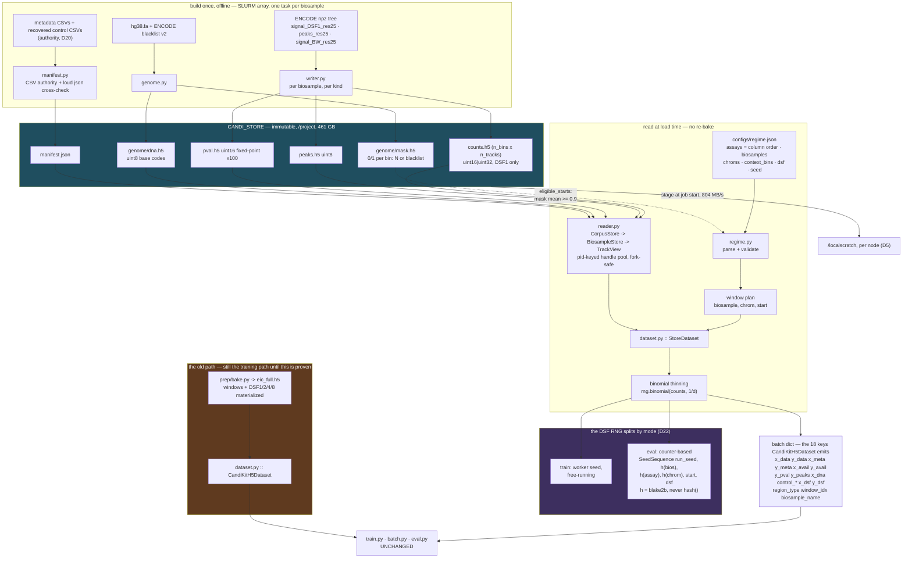

# STORE.md — the corpus store contract

Owns: the CANDI_STORE on-disk layout, the three codecs, the `n_bins` rule, the root attrs, the
manifest and its metadata authority, the CLI, the recipes in *Using the store*, and the traps —
each with the symptom you will actually see.
The **old** window-materialized bake → `DATA.md`. Metric contract → `EVAL.md`. Invariants, tasks,
gates → `AGENTS.md`. The decisions behind every choice here, numbered `D1`–`D24` → `STORE_PLAN.md`.

Anchors are `file.py::symbol`, never line numbers. Source of truth is the code; where this file
disagrees with it, the code is right and this file is the bug.

**The store does not replace the bake yet.** `prep/bake.py` and `dataset.py::CandiKitH5Dataset`
are untouched (D21) and `candi.store` lands beside them. Since t23, `train.py` opens *either* —
`--h5` or `--store` — through one factory; evaluation is still h5-only (t14).

## What changed, in one sentence

The bake wrote **windows**; the store writes **chromosomes**, and everything that used to be frozen
into the h5 — window size, context length, DSF factor, chromosome split, assay column order — moves
into a regime file read at load time. One store, every regime, no re-bake.

```
ENCODE-style npz tree --[store.writer]--> CANDI_STORE --[store.reader + regime]--> batches
```

## The harness, end to end

Read it in three bands: **build once** into the immutable store, **stage** it to the node, then
**regime + mask decide which windows exist** and `StoreDataset` thins on the way out. The old bake
path is drawn alongside because both feed the same `train.py` through the same batch contract —
that is the whole point of D21, and it is what makes the two paths comparable at all.

This fence is the source. GitHub renders it; to get a PNG,
`npx @mermaid-js/mermaid-cli -i <extracted>.mmd -o out.png -s 3`. Kept here rather than as a
checked-in image so it cannot drift from the doc it explains.



## Using the store

Everything after this section is the **contract** — what each piece guarantees. This section is the
**path**: I have a store, now what. Each step names the section that owns its detail.

Both corpora are built and live under one root on Fir,
`/project/def-maxwl/mforooz/CANDI_STORE`:

| | | |
|---|---|---|
| `genome/` | 884 MB | `dna.h5` + `mask.h5` + `chrom_sizes.json` — shared, built once |
| `eic/` | 54.94 GB | 89 biosamples, 436 tracks, 35 assays, `counts` + `peaks` + `pval` |
| `merged/` | 406.06 GB | 361 biosamples, 3026 tracks, 47 assays, `counts` + `peaks` + `pval` |

Both carry a `manifest.json` and both pass `python -m candi.store verify`. `corpus_root` is
`CANDI_STORE/eic`, **not** `CANDI_STORE` — `reader.py::CorpusStore` says so by name when you get it
wrong.

**Every store command needs torch**, including the ones that touch no tensor. `candi/__init__.py`
imports `candi.encoder` eagerly, so the parent package pulls torch in before `candi.store.layout` is
reached, and `python -m candi.store build-genome` is as torch-dependent as `StoreDataset` is. On Fir
that venv is `/project/6014832/mforooz/EpiDenoise/candi_venv` (py3.10.13, torch 2.6.0, h5py 3.12.0).
`~/scratch/enctest_env` is py3.11 with **no torch** and cannot run any of this.

### Read data ad hoc

```python
from candi.store.reader import CorpusStore

corpus = CorpusStore("/project/def-maxwl/mforooz/CANDI_STORE/eic")

corpus.biosamples                          # ['B_BE2C', …] sorted, verbatim ids (D16)
corpus.assay_vocabulary                    # the 35 assay names; the control is not one of them
corpus.resolution                          # 25
corpus.chroms()                            # ['chr1', …, 'chr22', 'chrX', 'chrY']
corpus.n_bins("chr21")                     # floor(chr_len / 25)
corpus.biosamples_with("ATAC-seq")         # which biosamples carry an assay
corpus.track_meta("T_DND-41", "H3K4me3")   # depth / read_length / run_type / accessions, or None
```

One biosample, then one read:

```python
bs = corpus["T_DND-41"]

bs.kinds                    # ['counts', 'peaks', 'pval'] — whichever files exist
bs.tracks()                 # STORAGE order, control last (layout.py::order_tracks)
bs.assays()                 # the same list with `chipseq-control` dropped
bs.has("H3K4me3", "peaks")  # test before you read — an absent assay RAISES, it is not zero-filled
bs.control_col, bs.has_control, bs.dtype, bs.n_bins("chr1")
```

Every read is in **bin** coordinates, half-open `[start, end)`:

```python
counts = bs.counts("chr1", 0, 768, assays=["H3K4me3", "ATAC-seq"])   # (768, 2) int32
peaks  = bs.peaks("chr1", 0, 768, assays=["H3K4me3"])                # (768, 1) uint8, 0/1
pval   = bs.pval("chr1", 0, 768, assays=["H3K4me3"])                 # (768, 1) float32, -log10 p
ctrl   = bs.control("chr1", 0, 768)                                  # (768, 1) int32
one    = bs["H3K4me3"].counts("chr1", 0, 768)                        # (768,)   int32
```

`assays=` is a permutation and is honoured (D14); omit it to get the file's storage order.
`bs.block(kind, chrom, start, end, assays=…)` is the same read with the kind carried as data.

The genome layer hangs off `corpus.genome`, and `dna` is the one accessor in **base pairs**:

```python
corpus.genome.dna("chr1", 0, 19_200)          # (19200,)   uint8 codes  A=0 C=1 G=2 T=3 N=4
corpus.genome.dna_onehot("chr1", 0, 19_200)   # (19200, 4) float32; N is an all-zero row
corpus.genome.mask("chr1", 0, 768)            # (768,)     uint8 0/1 — bins, not bp
```

Bin `b` covers `[b*25, (b+1)*25)` bp. That multiplication is the only conversion anything should do.

Dtypes are the reader's, not the file's: counts come back `int32` whether the file is `uint16` or
`uint32`, and pval comes back decoded, never as the stored fixed point. Close the handles when you
are done, or take the store as a context manager:

```python
with CorpusStore("/…/CANDI_STORE/eic") as corpus:
    ...
```

Detail → *Reading the store*.

### Write a regime file

A regime is a JSON object. Three keys are required; everything else has a default that
`regime.py::Regime.from_dict` fills in.

| key | required | what it means |
|---|---|---|
| `store` | **yes** | the corpus root. `StoreDataset(corpus=…)` overrides it — that is how a job reads a staged copy without editing the file |
| `assays` | **yes** | **THE column order** (D14). No duplicates; `chipseq-control` is refused |
| `context_bins` | **yes** | window length in bins; `768` bins = 19,200 bp at resolution 25 |
| `biosamples.train` / `.eval` | no | the pool per split. Empty → `StoreDataset` falls back to every biosample in the store. Any key other than `train` / `eval` raises |
| `train_chroms` / `eval_chroms` | no | must be disjoint, and every name must be in the store. A split with no chromosomes raises when its windows are planned, not at parse time |
| `window_plan.type` | no | `tile` is the only plan. An overlapping plan is a smaller stride, not another type |
| `window_plan.stride_bins` | no | defaults to `context_bins` — non-overlapping tiles |
| `window_plan.min_valid_frac` | no | D12, default `0.9` |
| `dsf.policy` | no | `discrete` (default), `loguniform`, or `off` (pins DSF 1) |
| `dsf.levels` | no | the discrete ladder, default `[1, 2, 4, 8]`; every level must be ≥ 1 |
| `dsf.min` / `dsf.max` | no | the loguniform bounds; `1 <= min <= max` |
| `kinds` | no | default `["counts", "peaks"]`; **must include `counts`**, and every named kind must exist for every named biosample |
| `seed` | no | default `42`. `StoreDataset` splits this into `seed` (pool order) and `run_seed` (thinning) |

**An unknown key is silently ignored.** `Regime.from_dict` reads the keys it knows and never
inspects the rest, so `"contxt_bins": 6144` parses clean and trains at the default 768. This is the
opposite of a panel file, which rejects unknown keys (`AGENTS.md` §4.3). Round-trip a regime through
`Regime.from_file(p).to_dict()` and diff it against the file if you want the typo to show.

Two regimes exist and both run:

* `configs/regime.eic_smoke.json` — 8 assays, 5 biosamples, chr19 train / chr21 eval, `counts` +
  `peaks`. The store-era counterpart of `configs/panel.q19.json`, sized to run off a five-biosample
  slice.
* `configs/regime.equiv.json` — 35 assays in the old bake's own availability-sorted order, 51 train
  and 38 eval biosamples, `counts` + `peaks` + `pval`, `seed` 0. **Generated**, by
  `cruxvault/results/train_ab/make_regime.py`, from `eic_full.h5`'s attrs — it is the regime that
  reproduces the bake's panel exactly, and it is the one to copy when the question is "same panel,
  new knob".

`Regime.sha256` and `Regime.raw` are the file's hash and its bytes. Put both in `run.json` beside
the manifest's hash, or the run cannot be reproduced.

### From regime file to `DataLoader`

```python
from torch.utils.data import DataLoader
from candi.store.dataset import StoreDataset

ds     = StoreDataset("configs/regime.eic_smoke.json", train=True, batch_size=8)
loader = DataLoader(ds, batch_size=None, num_workers=4)

for batch in loader:
    ...            # batch["x_data"] is [8, 768, F] float32
```

**`batch_size=None` is not optional.** `StoreDataset` is an `IterableDataset` that yields whole
batches already assembled — `_make_batch` returns `[B, L, F]` tensors — so `batch_size=None` turns
DataLoader's own batching and collation off and the loop sees exactly what the dataset built. Any
other value stacks `N` of those into `[N, B, L, F]`.

The dataset shards itself across workers (`dataset.py::StoreDataset.__iter__` reads
`get_worker_info`), so every window lands in exactly one worker whatever `num_workers` is. The old
`CandiKitH5Dataset` does **not** — four workers there replay the same window stream four times, so
an old-path worker count is a throughput number and not a training configuration.

The knobs `StoreDataset` takes beyond the regime: `train` (picks the split and the RNG regime),
`batch_size`, `corpus` (a `CorpusStore` that overrides `regime.store`), `dsf_sampling`
(`uniform` / `off` / `x_eq_y` / `upsample_only`), `shuffle`, `seed`, `run_seed`, `deterministic`,
`biosamples`, `chroms`, `meta_missing` (`unavailable` / `error`) and `require_dna`.

`train=False` sets `deterministic=True` by itself, which is what makes an eval number independent of
worker count (D22). Do not pass `deterministic=False` to an eval run to "match training".

What comes out — 18 keys, the same set, fills and dtypes `CandiKitH5Dataset` emits on the training
path — is in *`StoreDataset` — the batch dict, unchanged*.

### Train off the store

`train.py` opens a store through **one** flag (t23):

```bash
python -m candi.train --store configs/regime.eic_smoke.json --out-dir runs/smoke \
    --tag store_smoke --epochs 25 --steps-per-epoch 200 --batch-size 8 --d-model 32
```

`--h5` and `--store` are **mutually exclusive and exactly one is required** — argparse refuses
both-or-neither on the submit line. `--store` takes the **regime file**, not the corpus root: the
regime already carries `store` as a required key, so a second flag could only duplicate or
contradict it. `--regime-file` is the same flag under a clearer name.

**`--regime` is a different thing and always was.** It is the *masking* regime (`type1` /
`type2_loci`) and has nothing to do with a regime file. `type2_loci` is h5-only — the store plans
its own windows from `window_plan` — and `--regime type2_loci --store …` is refused.

What the store path does differently:

| | `--h5` | `--store` |
|---|---|---|
| scale (assays, context, resolution, splits) | `h5.attrs` | the regime file |
| `depth_center` | `dataset.py::h5_depth_center` | `StoreDataset.depth_center()` — the same median, over the regime's train split. Still overridable with `--depth-center`. |
| `num_cells` / `--cell-cond` | as baked | **0**, and any `--cell-cond` other than `off` **raises** (D16) |
| `--reference on` | supported | **refused** — the table pins itself to an h5 fingerprint |
| `--eval-every` | mid-training eval + best-ckpt selection | forced **off**, loudly |
| M1/M2/M3/S14 | scored | **not scored** — see below |

Every dataset on either path is built by `train.py::make_dataset(source, mask_regime, …)`, the one
factory all three construction sites go through, and the path is chosen once by
`train.py::DataSource.resolve(h5=…, store=…)`.

The run json records which path ran. On the store path that is, per `STORE_PLAN.md` §4:
`data_source: "store"`, `store`, `regime_file`, **`regime_json`** (the file verbatim),
**`regime_sha256`** and **`store_manifest_sha256`**. `h5` is `null`. On the h5 path it is
`data_source: "h5"` and the same `h5` key every earlier run json already had.

The pre-t23 harness `cruxvault/results/train_ab/bench_ab.py` still runs and is still the right tool
for an A/B against the old loader; it is no longer the only way to train off a store.

#### A store-backed imputation eval scores nothing, and says nothing

**Symptom: none.** Drive `eval.py`'s scoring off a `StoreDataset` and it runs, writes its report,
and the imputation arm is empty.

`StoreDataset` does not emit `y_data_imp`, `y_pval_imp`, `y_peaks_imp`, `y_meta_imp`,
`imp_biosample_name` or `log_ref`. `eval.py` reads every one of them through `batch.get(...)`, so
nothing raises — the imputation arm and `healthcheck.py`'s h74 reference arm simply degrade to
nothing. **Do not score an imputation run off the store until task `t14` lands.** Training is
unaffected; it never reads those keys.

`train.py --store` therefore **does not call `evaluate()` at all** and writes a run json with no
`M1` / `M2` / `M3` / `S14` keys, rather than an `M1` pooled over zero targets — which reads in a
json exactly like a finished evaluation. `--eval-every` is forced off for the same reason. Score a
store-trained checkpoint by re-running `candi.eval --arch-from <run>.json` against a baked h5, or
wait for `t14`.

#### `cell_cond` is refused, not defaulted

Porting a training command that passed `cell_cond` will stop here:

```
cell_cond is not carried into the store path yet. The 5th metadata row keys on a cell type
derived by splitting a T_/V_/B_ prefix (`dataset.py::base_cell_type`), and D16 makes store
biosample names opaque ids that nothing may parse.
```

`cell_cond="off"` is the only accepted value (D16). Deciding what a cell identity is for
`A549_nonrep` is a task, not a default — so `num_cells` is 0 and the 5th row does not exist.

### Build a store for a corpus that does not exist yet

Four steps, in this order. The genome layer is shared and is built **once**; D24 puts `pval` last.

**1 — the genome layer**, once per `CANDI_STORE` root, ~2.5 minutes on one node:

```bash
python -m candi.store build-genome \
    --store-root /project/def-maxwl/mforooz/CANDI_STORE \
    --fasta /project/6014832/mforooz/EpiDenoise/data/hg38.fa \
    --fasta-sha256 5be01555d98347fdb3714dc84c6f77c9d8bc774adcf32c6f7a8fa06f5baf5e51 \
    --blacklist /project/def-maxwl/mforooz/CANDI_STORE/genome/hg38-blacklist.v2.bed \
    --context-bins 768,6144 --report t7_genome_report.json
```

It writes `genome/chrom_sizes.json`, which every later `--chrom-sizes` falls back to.

**2 — one `build-biosample` per biosample**, as a SLURM array with no merge step — that is what D4
bought:

```bash
python -m candi.store build-biosample \
    --source-root /project/6014832/mforooz/DATA_CANDI_NEW \
    --corpus-root /project/def-maxwl/mforooz/CANDI_STORE/new \
    --chrom-sizes /project/def-maxwl/mforooz/CANDI_STORE/genome/chrom_sizes.json \
    --biosample "$B" --kinds counts,peaks --overwrite
```

**Do not write a new array script.** `cruxvault/results/t10/t10_build_eic.sh` is the pattern that
built EIC — `--array=0-88%30`, `sed -n "$((SLURM_ARRAY_TASK_ID + 1))p" biosamples.txt` to pick the
biosample, the fixed `--gres` spec (invariant 13), and sizing justified against t9's measured
per-task worst case rather than guessed. `cruxvault/results/t12/t12_build_pval.sh` is the same script
parameterised by `CORPUS` / `SRC` / `LIST` through `--export`, and is what to copy for a second
corpus. `--kinds pval` alone opens no other kind's file, so `--overwrite` is scoped to `pval.h5` and
a failed task can simply be resubmitted.

**3 — the manifest**, once the array is complete. `StoreDataset` cannot start without it: four of the
model's inputs are in it and the h5 deliberately does not carry them.

```bash
python -m candi.store build-manifest \
    --corpus-root /project/def-maxwl/mforooz/CANDI_STORE/new --corpus new \
    --metadata-csv <the signal metadata CSV> \
    --metadata-csv <the recovered control metadata CSV> \
    --source-root /project/6014832/mforooz/DATA_CANDI_NEW
```

EIC's pair, for reference, is `EpiDenoise/data/eic_metadata.csv` plus
`CANDI_STORE/eic_control_metadata.csv`.

`--metadata-csv` is repeatable and that is the whole mechanism for the recovered control metadata.
`--source-root` turns on the D20 cross-check against `file_metadata.json`. `--no-strict` is for
triage; a store you intend to train on is built without it.

**4 — verify**, and read the exit code:

```bash
python -m candi.store verify --corpus-root /project/def-maxwl/mforooz/CANDI_STORE/new
```

`0` and `<root>: OK`, or `1` and a numbered problem list. Then rerun `build-biosample` with
`--kinds pval` over the same list to add the p-value layer.

### Stage to `/localscratch` before training (D5)

The store lives on `/project` and is read from `/localscratch` on the node. The measured cost, on
the EIC corpus:

| | bytes | seconds | rate |
|---|---|---|---|
| `genome/` | 883,787,968 | 1.6 | 542 MB/s |
| `eic/` counts + peaks | 21,536,069,991 | 93.9 | 229 MB/s |
| `eic/` with `pval` | 55,826,431,918 | 208.8 | 267 MB/s |
| the old `eic_full.h5`, for comparison | 24,379,189,757 | 16.3 | 1494 MB/s |

Those store rows are `rsync -a`. **Use `cp`.** t9 measured 804 MB/s copying the same tier with `cp`,
about 3× the rsync rate — `rsync` earns its keep on an incremental sync, not on a first copy into an
empty `/localscratch`.

Whether staging pays back is arithmetic, not a rule. Against the old bake the store costs **192.5 s
more** to stage (208.8 vs 16.3) and saves **~29 s of data time per epoch** (36.7 s → 7.6 s of
`next(iterator)` over one 356-step epoch at `num_workers=0`), so it pays for itself after **~6.6
epochs** as measured, or **~1.8** if staged with `cp`. A single-epoch smoke test should not stage.

Point the run at the copy without editing the regime file: `StoreDataset` takes a `corpus=` argument
that overrides `regime.store`.

```python
StoreDataset(regime, corpus=CorpusStore("/localscratch/…/CANDI_STORE/eic"))
```

### What the loader actually costs

Measured on one Fir node, 4 cores, one H100 MIG 1g.10gb slice, 356 steps at batch 8, both sources
staged to `/localscratch`, same model and same init (`cruxvault/results/train_ab/`):

| workers | old bake, data time | store, data time | ratio |
|---|---|---|---|
| 0 | 104.6 ms/step | 21.8 ms/step | **4.80×** |
| 1 | | | 9.47× |
| 4 | | | 1.04× |

The per-step figures are the `num_workers=0` row, which ran the full 356 steps; the 1- and 4-worker
rows ran a shorter 150-step budget, so only their ratios are comparable.

**Quote the data-only figure.** End-to-end speedup depends entirely on being data-bound: at
`num_workers=0` data was 68.9% of the step on the old path and 31.7% on the store, and the timed
wall clock over the same 356 steps went 53.3 s → 24.1 s. At 4 workers both paths are GPU-bound and
the 1.04× is the honest number. `num_workers=0` is not a strawman — `train.py` iterates `iter(ds)`
directly and builds no DataLoader at all.

The two window plans are **not** the same size, so this is a rate comparison and not a like-for-like
epoch: chr19 gives 3,053 tiles on the old bake against 2,848 on the store, because D12 rejects the
blacklisted and N-heavy ones. Genome-wide at `min_valid_frac = 0.9` there are 146,978 tiled eligible
windows at `L = 768` and 18,209 at `L = 6144`, out of a genome that is 0.916786 valid bins.

Where the two paths were made to agree, they agree exactly: counts, peaks, DNA, availability and all
four metadata covariates are bit-identical between the store and `eic_full.h5`, **0 differing
elements of 143.2 M**. The five places they deliberately differ — window plan, DSF realization, the
`y_pval` transform, control availability on 11 of the 51 train biosamples, and the peaks sentinel in
absent columns — are the `not_matched` list in
`cruxvault/results/train_ab/results/analysis.json`.

## On-disk layout

```
CANDI_STORE/
  genome/                      # shared across corpora — built once, by build-genome
    dna.h5                     /chr1 …  (chr_len,)  uint8 codes A=0 C=1 G=2 T=3 N=4
    mask.h5                    /chr1 …  (n_bins,)   uint8 0/1
    chrom_sizes.json           {"chr1": 248956422, …}
  eic/
    manifest.json              generated — never hand-edited
    biosamples/
      T_DND-41/
        counts.h5              /chr1 …  (n_bins, n_tracks)  uint16 | uint32
        peaks.h5               /chr1 …  (n_bins, n_tracks)  uint8
        pval.h5                /chr1 …  (n_bins, n_tracks)  uint16, scale 100
  merged/                      same shape
```

Every path in that tree comes from `store/layout.py` — `layout.py::kind_path`,
`::manifest_path`, `::biosample_dir`, `::genome_dir`, `::corpus_genome_dir`. Nothing in the package
joins a path by hand, and neither should anything downstream.

`corpus_root` is `CANDI_STORE/<corpus>`, e.g. `CANDI_STORE/eic`. That is the handle the reader takes
(`CorpusStore("/…/CANDI_STORE/eic")`); `genome/` is its **sibling**, not its child.

### One dataset per chromosome, whole and contiguous

`(n_bins, n_tracks)` per (biosample, kind, chromosome) — D1 and D3. HDF5 chunking is an internal
compression block, **not** a window: any `[start:stop]` is addressable at the same cost, so one read
serves a whole window across every assay at once.

The `biosample → experiment → kind → chrom` tree people think in lives in the **Python API**
(`reader.py`, t8), not in HDF5 group paths.

### Chunk and codec are fixed and measured

`(1024 bins, all tracks)`, gzip level 4, every kind (`layout.py::dataset_kwargs`). Measured on real
`T_DND-41` chr1: gzip4 is 22% smaller than gzip1 at identical read latency. lzf is 2.2× larger.

**Blosc and zstd are not available on Fir** — the Compute Canada `hdf5plugin` wheel is a stub with
no filters registered. Do not add a codec here that the cluster cannot read back.

## The three kinds and their codecs

| kind | source dir | dtype | rule |
|---|---|---|---|
| `counts` | `signal_DSF1_res25/chr*.npz` | `uint16` or `uint32` | **per FILE**, from the biosample's global max (D7) |
| `peaks` | `peaks_res25/chr*.npz` | `uint8` | D8 |
| `pval` | `signal_BW_res25/chr*.npz` | `uint16` | fixed point, `round(-log10p * 100)` (D9) |

`counts` is **DSF1 only** (D6). DSF2/4/8 are not stored; the loader thins binomially, which is
exactly what the source DSF levels were (verified to 3–4 decimals against `Binomial(k, 1/d)`).

### The counts dtype is one per file, chosen by a full pre-pass

`writer.py::_scan_counts_max` reads every counts npz of the biosample once **before** writing
anything, and `layout.py::counts_dtype_for_max` turns that global max into `uint16` (max ≤ 65535)
or `uint32`. The dtype goes in the `dtype` root attr and in the manifest; the reader upcasts, so a
`uint16` store and a `uint32` store are interchangeable downstream.

That pre-pass doubles the read cost of a build. It buys one dtype for the whole file instead of one
per chromosome, which is what keeps `reader.py` from special-casing every slice. `--counts-dtype`
skips the scan when a previous run already told you the answer.

`B_DND-41`/DNase-seq reaches **52,051** reads in one 25 bp bin — under `uint16`, but the reason the
rule exists rather than a hardcoded width.

### The pval codec is lossy by design, and the bound is 0.005 plus a float32 epsilon

`layout.py::encode_pval` / `::decode_pval`. `round(-log10 p * 100)` clipped to `[0, 65535]`, so the
resolution is 0.01 and the ceiling is **655.35**. Quantization error is half a step, **0.005** on
`-log10 p`, against a chr1 observed max of 161.2. Storage: 0.771 B/bin against 2.727 for the source
float32, a 3.5× win (measured on the t9 slice: 0.722 B/bin).

**Do not assert `err <= 0.005` on real data — it fails.** t9 measured a round-trip max of
**0.0050011** on `B_DND-41/DNase-seq/chr1`. The extra 1.1e-6 is not the codec: `decode_pval` returns
float32, and a value near 161 has a float32 spacing of ~1e-5, so the decoded number cannot land
exactly on the quantized one. The honest bound is `0.005 + float32 eps at the magnitude concerned`.
A test that wants a hard number should use `0.0051`, or compare in float64.

Stored in the **original space** — no arcsinh at bake time. Every transform belongs to the model,
the same rule `DATA.md` states for counts. This is a deliberate departure from the old bake, which
arcsinh'd pval on the way in.

Clipping is counted per track and written to the `pval_clip_frac` root attr and into the manifest.
`+inf` is a real `-log10 p` (`p == 0`) and clips to the ceiling; **NaN is refused** — see the traps.

## `n_bins` is `floor`, for every kind, always

`layout.py::n_bins_for` — `n_bins = chr_len // resolution`, and `layout.py::fit_to_n_bins`
truncates a source array that is one bin longer.

The counts npz is `ceil(chr_len / resolution)` and the pval and peaks npz are `floor` — a real
one-bin difference measured on the reference corpus, and the source of a documented trap in
`DATA.md`. Storing the floor everywhere kills it outright: every kind, every chromosome, one length.

Anything that is neither `n_bins` nor `n_bins + 1` raises `layout.py::LengthMismatch` naming
`<biosample>/<track>/<kind>/<chrom>`. There is no tolerant mode.

## Root attrs — every file is self-describing

Written by `layout.py::root_attrs`, read back by `layout.py::read_root_attrs` (which decodes the
JSON-encoded ones — do not touch `.attrs` directly).

| attr | kinds | contents |
|---|---|---|
| `schema` | all | `1` |
| `biosample` | all | the opaque id, verbatim |
| `kind` | all | `counts` / `peaks` / `pval` |
| `resolution` | all | `25` |
| `tracks` | all | JSON list — **the column order of this file** |
| `control_col` | all | int column index of `chipseq-control`, or `-1` |
| `dtype` | all | e.g. `uint16` |
| `n_bins` | all | JSON dict `{chrom: n_bins}` |
| `source_root` | all | the npz tree it was built from |
| `kit_version`, `built_utc` | all | provenance |
| `dsf` | counts | always `1` (D6) |
| `npz_depth` | counts | JSON list aligned with `tracks`; `depth` as the npz tree reported it, `null` where absent |
| `scale` | pval | always `100` |
| `pval_clip_frac` | pval | JSON list aligned with `tracks` |

### Storage column order is not model column order

`layout.py::order_tracks` sorts assays alphabetically and puts `chipseq-control` last. That is
**storage** order only. The model's assay order is **declared in the regime file** (D14) and mapped
onto these columns by name; the old derived, availability-sorted order and its bijection asserts are
gone.

### The control is a normal column

`chipseq-control` is a column of `counts.h5` like any other, flagged by `control_col` (D18).
`peaks.h5` and `pval.h5` have no control column and carry `control_col = -1`, because the source
corpus gives the control neither peaks nor a p-value track.

### Biosample names are opaque ids

Used verbatim, everywhere (D16). Nothing in this package parses a `T_` / `V_` / `B_` prefix — the
old first-letter filter silently accepted `vagina_nonrep`, `BJ_nonrep` and `BE2C_grp1_rep1` as
train/val/blind biosamples. EIC's prefixes remain meaningful **by convention only**.

### Nothing is filtered

Everything on disk is stored, RNA-seq and the whole long tail included (D15). The
`if "RNA-seq" in exps: exps.remove(...)` that ran at three loading sites in the old handler does not
exist here. Selection is the regime file's job, at load time.

## `manifest.json` — the corpus-level record

Built by `manifest.py::build_manifest`, written by `::write_manifest`. **Generated, never
hand-edited**: regenerate it instead.

```json
{
  "schema": 1, "corpus": "eic", "resolution": 25,
  "genome": {"build": "GRCh38", "fasta_sha256": "…", "n_bins": {"chr1": 9958256}},
  "assay_vocabulary": ["ATAC-seq", "CTCF", "DNase-seq", "…"],
  "kinds": ["counts", "peaks", "pval"],
  "biosamples": {
    "T_DND-41": {
      "dtype": "uint16", "control_col": 9,
      "kinds": ["counts", "peaks"], "chroms": ["chr1", "…"],
      "tracks": [{"assay": "H2AFZ", "col": 0, "depth": 24684534, "read_length": 36,
                  "run_type": "single-ended", "file_accession": "ENCFF764MJJ",
                  "exp_accession": "ENCSR…", "bios_accession": "ENCBS…",
                  "lab": "…", "platform": "…", "assembly": "GRCh38",
                  "npz_depth": 24684534, "pval_clip_frac": 0.0,
                  "kinds": ["counts", "peaks"]}]
    }
  },
  "source_root": "…", "built": {"kit_version": "…", "utc": "…"},
  "metadata_csvs": ["…"], "metadata_gaps": [{"biosample": "…", "track": "…",
                                             "field": "read_length", "reason": "absent"}]
}
```

The **structural** facts — track order, `dtype`, `control_col`, `n_bins`, `pval_clip_frac` — are
read straight off the h5 root attrs, because the h5 is the record. The CSVs supply only the
per-track experimental metadata.

`assay_vocabulary` excludes `chipseq-control`: it is a column, not an assay, and the regime file's
`assays` list should not contain it.

### The CSVs are the authority; `file_metadata.json` must agree

D20. `manifest.py::read_metadata_csvs` merges one or more CSVs into a
`(biosample_name, assay_name) -> fields` table; `manifest.py::read_file_metadata` flattens the
per-track json; `build_manifest` compares `assay`, `accession`, `read_length` and `run_type` and
raises `manifest.py::MetadataConflict` listing every disagreement.

`--metadata-csv` is repeatable. That is the whole mechanism for t5's `control_metadata.csv` — it has
the same columns as the signal CSVs and joins the same table, with no code path of its own.

`--no-strict` downgrades a conflict to a warning plus a `metadata_gaps` entry. It exists for triage.
Do not build a store you intend to train on with it.

### Nothing is fabricated

D19. A field that is missing, unparseable, or contradicted by a second CSV row is written as an
explicit `null` and listed in `metadata_gaps`, so the encoder's `readlen_missing_emb` and
`depth_missing_emb` get the case they exist for. The old path's `read_length = 50` and
`run_type = single` fallbacks are gone, and so is the hard-coded replicate key `"2"` — whatever
replicate key a `file_metadata.json` field carries is the one used, and more than one raises —
for the four fields the cross-check consumes (`_CROSS_CHECK`). Not every dict-valued field is
replicate-keyed: `DATA_CANDI_EIC/T_testis/H3K9me3` carries a free-text `notes` dict keyed by
`alternative_bigbed_used` / `original_bigbed` / `alternative_reason`. Nothing reads `notes`, so it
is passed through unflattened rather than resolved by a coin flip or made fatal for the corpus.

## The genome layer — `dna.h5`, `mask.h5`, and which windows exist

`genome/` is **shared**: `eic/` and `merged/` are its siblings, not its owners
(`layout.py::genome_dir`, `::corpus_genome_dir`). Nothing in `genome.py` knows about biosamples,
tracks or assays. One build serves every corpus and every regime.

```
hg38.fa            --[genome.py::build_dna]--->  genome/dna.h5   (chr_len,) uint8 base codes
dna.h5 + blacklist --[genome.py::build_mask]-->  genome/mask.h5  (n_bins,)  uint8 0/1
mask.h5            --[genome.py::eligible_starts]-> the window starts a regime may sample
```

### `dna.h5` is base-pair resolution, not bin resolution

One `uint8` array per chromosome of length `chr_len` — `A=0 C=1 G=2 T=3 N=4` (D10), chunk
**25600 bp**, gzip 4. 25600 is exactly `CHUNK_BINS * DEFAULT_RESOLUTION`, so one DNA chunk spans
the same interval as one chunk of a counts/peaks/pval dataset.

Everything is **uppercase-folded**: soft-masked lowercase `acgt` are real bases and get their own
codes, not `N`. The old bake's repeat-masking is not carried over — repeat state is a modelling
choice, and the store does not make it for you.

`genome.py::GenomeLayer.dna_for_bins` is the bridge between the two coordinate systems: bin `b`
covers `[b*25, (b+1)*25)` bp, and that is the only conversion anything should perform.

### Ambiguous IUPAC letters become `N`, and are counted

`R Y S W K M B D H V` in either case are coded `N = 4`. D11 makes `N` mean "this base is not a
determined A/C/G/T", and an ambiguity code is exactly that. They are tallied per letter into the
`iupac_counts` root attr so that folding a large number of them shows up instead of vanishing.
On hg38 the tally is **empty** — the primary assembly carries only `ACGTN`.

### `mask.h5` is bin resolution, and says why a bin is out

One `uint8` 0/1 array per chromosome, `n_bins = floor(chr_len / 25)` (D13, `layout.py::n_bins_for`).
A bin is invalid when it **contains any `N`** or **overlaps a blacklist interval by even one bp**
(D11). The exact sentence is in the `rule` root attr, so the file states its own definition.

`genome.py::build_mask` takes its N flags from `dna.h5`, never from a second FASTA parse — the mask
therefore cannot disagree with the DNA beside it.

The blacklist is the real ENCODE hg38 v2 (t4): 636 intervals, 227,162,400 bp. It arrives in
**lexicographic** chromosome order (`chr1, chr10, chr11, …, chrY`), so
`genome.py::read_blacklist` groups by chromosome and sorts and merges within each group. It does
that even though the delivered file is already merged, because relying on that is how a
re-download with different provenance becomes a silent under-count.

`genome.py::blacklist_bin_flags` turns the whole interval set into one difference array plus one
cumulative sum, so 636 intervals cost one pass over the chromosome, not 636.

The build summary splits invalid bins into **N**, **blacklist**, and **both**. The overlap is
large — the blacklist covers centromeres, which are also `N` — and a single "invalid" number
hides which rule is doing the work.

### Genome-wide coverage, as built

`fasta_sha256 = 5be01555d98347fdb3714dc84c6f77c9d8bc774adcf32c6f7a8fa06f5baf5e51`
(`EpiDenoise/data/hg38.fa` and `DATA_CANDI_MERGED/hg38.fa` are byte-identical);
`blacklist_sha256 = 31c69342df43bbc19dd8ef2886611a8150cb53e90f341de14d30e742c9251737`.

The chromosome set is `chrom_sizes.json`'s, **verbatim**: chr1–chr22, chrX, chrY. Alts, randoms,
`chrUn_*` and `chrM` are in the FASTA and are skipped — no corpus track covers them, so a mask bin
there could never be sampled.

| | |
|---|---|
| `dna.h5` | **877,062,209 B** for 3,088,269,832 bp — 0.28 B/bp |
| `mask.h5` | **6,662,180 B** for 123,530,780 bins — 0.054 B/bin |
| valid bins | 113,251,272 / 123,530,780 = **0.9168** |
| invalid by N | 6,026,108 bins |
| invalid by blacklist | 9,086,496 bins (= 227,162,400 bp exactly — the blacklist is bin-aligned) |
| invalid by both | 4,833,096 bins |

The floor is not uniform: chrY is **0.4332** valid, chr22 0.6815, chr21 0.7371, chr15 0.7585 —
against chr4's 0.9813. A regime that puts chr21 or chr22 on the eval side is choosing a
chromosome where a quarter to a third of the bins do not exist.

Eligible windows genome-wide at `min_valid_frac = 0.9`: **146,978 tiled** at `L = 768` and
**18,209 tiled** at `L = 6144` (2,353,634 model parameters against 18,209 non-overlapping 6144-bin
windows is the number to keep in view). Every-start counts are 112,880,377 and 111,883,465.

The whole layer builds in **2.5 minutes** on one Fir node at 3.1 GB peak RSS
(`genome/t7_build_genome.sh`, the numbers in `genome/t7_genome_report.json`). It is cheap enough
to rebuild rather than repair.

### Window eligibility is a cumulative sum, not a loop

D12: a window of `L` bins starting at bin `s` is eligible iff `mask[s:s+L].mean() >=
min_valid_frac`, default **0.9**, overridable in the regime file.

`genome.py::window_valid_counts` is one cumsum over the mask, so the cost is `O(n_bins)` whatever
`L` is; `::eligible_window_mask`, `::eligible_starts` and `::count_eligible` sit on top of it.
`regime.py` imports these rather than re-deriving the rule — the threshold comparison in
particular, which uses `count >= frac * L - 1e-9` so a threshold landing exactly on an integer
(`L = 100`, `frac = 0.9` → 90) is inclusive instead of at the mercy of the last bit of the product.

`stride` picks the plan: `stride = L` is the tiled, non-overlapping count a `window_plan.type =
"tile"` epoch draws from, `stride = 1` is the size of the sampling space under a random-start plan,
and `offset` shifts a tiling to give a second disjoint one over the same chromosome.

### `GenomeLayer` is the read side, and the build-mismatch check lives in its constructor

```python
g = GenomeLayer(genome_dir, fasta_sha256=manifest["genome"]["fasta_sha256"])
seq = g.dna("chr1", 1_000_000, 1_019_200)     # (19200,) uint8 codes
idx = g.eligible_starts("chr1", 768)          # int64 start bins
```

Two hashes are checked before a single base is read. `mask.h5`'s `fasta_sha256` against `dna.h5`'s
— **always**, no argument needed, which is why `build_mask` copies it across. And, when the caller
supplies one, the expected FASTA hash against what `dna.h5` records. Either mismatch raises
`StoreError`. `genome.py::verify_genome` is the same check as a problem list, and `build-genome`
runs it after every build.

`GenomeLayer.mask` caches the whole chromosome — the genome is ~124 MB of mask, and every
eligibility query wants all of it.

## Reading the store

```python
from candi.store.reader import CorpusStore

corpus = CorpusStore("/…/CANDI_STORE/eic")
bs     = corpus["T_DND-41"]
counts = bs["H3K4me3"].counts("chr1", 0, 768)          # (L,)   int32
block  = bs.counts("chr1", 0, 768, assays=[...])       # (L, F) int32, DECLARED order
peaks  = bs.peaks("chr1", 0, 768, assays=[...])        # (L, F) uint8, 0/1
pval   = bs.pval("chr1", 0, 768, assays=[...])         # (L, F) float32, -log10 p
dna    = corpus.genome.dna("chr1", 0, 19_200)          # (Lbp,) uint8 codes
```

`corpus -> biosample -> assay -> kind -> chromosome` is a **Python** tree (`reader.py::CorpusStore`,
`::BiosampleStore`, `::TrackView`), not an HDF5 one (D3). Coordinates are **bins** everywhere except
`GenomeView.dna`, which is base pairs.

Three things the reader does that the files do not:

* **Upcasts counts to `int32`** (`reader.py::COUNTS_OUT_DTYPE`), so a `uint16` store and a `uint32`
  store are indistinguishable downstream (D7), and a `-1` MISSING sentinel fits without a re-cast.
* **Decodes pval** through `layout.py::decode_pval` at the file's own `scale` attr (D9). Nothing
  outside the writer ever sees the fixed point.
* **Returns columns in the order asked for.** `assays=[…]` is a permutation, and it is honoured;
  h5py's increasing-index requirement is handled inside `reader.py::BiosampleStore._read`.

`manifest.json` is read when present and **cross-checked** against the root attrs on first access to
each biosample (`reader.py::CorpusStore._cross_check`). The h5 is the record; the manifest supplies
only the corpus view (`assay_vocabulary`) and the per-track experimental metadata (`track_meta`).

## The regime file

`regime.py::Regime.from_file` parses, `::validate_against` checks it against a real store, and
`::windows` generates the plan. The schema is `STORE_PLAN.md` §4; a copy that runs is
`configs/regime.eic_smoke.json`.

**`assays` is the column order** (D14) — declared, never derived. `regime.py::Regime.assay_columns`
is the single place a name becomes a column index. The old availability-sorted order permuted every
column whenever a biosample was added; it and its bijection asserts are gone.

**Window eligibility is D12**: `mask[s:s+L].mean() >= min_valid_frac`, default `0.9`, overridable per
regime. The primitive is `genome.py::eligible_starts` (t7); `regime.py::eligible_starts` calls it
lazily and keeps a private cumulative-sum fallback for a checkout that has the store but not the
genome layer.

**DSF policy is D23**: `{"policy": "discrete", "levels": [1,2,4,8]}` by default;
`{"policy": "loguniform", "min": 1, "max": 8}` for the continuous version; `{"policy": "off"}` pins
DSF1. `regime.py::DsfPolicy.sample` is the only draw.

`Regime.sha256` and `Regime.raw` are the file verbatim and its hash — put both in `run.json`
alongside the manifest's hash, or a run cannot be reproduced.

## `StoreDataset` — the batch dict, unchanged

`dataset.py::StoreDataset` emits the key set `dataset.py::CandiKitH5Dataset` emits **on the training
path**, so `train.py` and `batch.py` need no edit:

```
x_data  x_meta  x_avail  x_dna   y_data  y_meta  y_avail  y_pval  y_peaks
control_data  control_meta  control_avail  x_dsf  y_dsf  control_x_dsf
biosample_name  region_type  window_idx
```

Same fills, same dtypes: `x_data/y_data` `[B, L, F]` float32 pre-filled with `MISSING`,
`x_meta/y_meta` `[B, 4, F]` likewise, `*_avail` `[B, F]`, `y_pval/y_peaks` and `control_*`
zero-filled, `region_type` uint8. One biosample per batch. Use it with
`DataLoader(ds, batch_size=None, num_workers=N)` — it batches and shards itself.

### The eval-only keys are NOT emitted yet, and the failure is silent

**Symptom: none.** `eval.py` runs, reports, and the imputation arm is simply empty.

`CandiKitH5Dataset` also emits `y_data_imp`, `y_pval_imp`, `y_peaks_imp`, `y_meta_imp`,
`imp_biosample_name` and `log_ref` on the eval path. `StoreDataset` emits none of them, and
`eval.py` reads every one through `batch.get(...)` — so nothing raises and the imputation arm of
eval, plus `healthcheck.py`'s h74 reference arm, degrade to nothing. **Do not score an imputation
run off the store until this lands.** Training is unaffected.

### An absent control is filled with `0`, and the old path fills it with `MISSING`

Neither is fully right, and the difference is worth knowing before you compare runs.

`StoreDataset` leaves `control_data` / `control_meta` at their zero initialisation and sets
`control_avail = 0`, which is correct availability. `0` in `control_meta[0]` still reads as
`log2(depth) = 0` rather than "unknown"; `MISSING` would be the honest fill and would match every
other absent channel in the same dict.

The old path is worse, and this is a live bug in the current training path rather than a style
difference: `dataset.py::CandiKitH5Dataset` computes
`control_avail = 1.0 if (control_data != 0).any()`, and the bake fills an absent control with
`MISSING = -1`. Since `-1 != 0`, **an absent control is marked available and a channel of −1 is fed
to the model** — on 16 of 89 EIC biosamples. Measured, not inferred; see the t9-era equivalence
run.

`MISSING = -1` and `CLOZE = -2` come from `_vendored.py`; the loader writes **only** `MISSING`,
exactly as the old one does. `CLOZE` belongs to `batch.py::prepare_masked_batch`.

Two departures from the bake, both deliberate:

* **`y_pval` is raw `-log10 p`**, not `arcsinh`. Every transform belongs to the model (D9), which is
  the same rule `DATA.md` states for counts. The old bake arcsinh'd on the way in.
* **`region_type` is always `255`** (`prep/bake.py::REGION_TILE`). The store tiles chromosomes and
  has no cCRE annotation, so a `type2_loci`-style 0/1 would be a fabrication.

### DSF is generated, not stored

D6: `counts.h5` holds DSF1 only and `dataset.py::thin_counts` does `rng.binomial(counts, 1/d)` per
element. `dataset.py::StoreDataset._depth_adjusted` moves the depth covariate with it —
`meta[0] -= log2(d)`, which is `prep/bake.py`'s F4 gate applied at load time instead of bake time.

### The eval RNG is counter-based (D22)

Training draws from one free-running generator per worker, seeded from the DataLoader worker seed.
**Evaluation seeds every single draw** from
`SeedSequence([run_seed, h(biosample), h(assay), chrom_id, window_start, dsf_milli])`
(`dataset.py::draw_seed`), so an eval window's thinned counts are a pure function of the window.

`h` is `dataset.py::stable_hash` — `blake2b(name.utf-8, digest_size=8)`. **Not** Python's `hash()`,
which is salted per process. `chrom_id` is the same stable hash of the chromosome name, not a
positional index that would shift when a chromosome is added.

`seed` (pool order) and `run_seed` (thinning) are separate arguments precisely so a shuffle can be
changed without changing the numbers.

## CLI

The genome layer is built **once** and every corpus shares it, so it comes first.

```bash
python -m candi.store build-genome \
    --store-root /project/def-maxwl/mforooz/CANDI_STORE \
    --fasta /project/6014832/mforooz/EpiDenoise/data/hg38.fa \
    --fasta-sha256 5be01555d98347fdb3714dc84c6f77c9d8bc774adcf32c6f7a8fa06f5baf5e51 \
    --blacklist .../CANDI_STORE/genome/hg38-blacklist.v2.bed \
    --context-bins 768,6144 --report t7_genome_report.json
```

`--chroms` restricts the build; `--only dna|mask` runs half of it; `--fasta-sha256` refuses a wrong
genome before it writes anything. The report JSON carries per-chromosome coverage and eligible
window counts at every `--context-bins` value, tiled and every-start.

Then, per corpus:

```bash
python -m candi.store build-biosample \
    --source-root /project/6014832/mforooz/DATA_CANDI_EIC \
    --corpus-root /project/def-maxwl/mforooz/CANDI_STORE/eic \
    --chrom-sizes /…/CANDI_STORE/genome/chrom_sizes.json \
    --biosample T_DND-41 --kinds counts,peaks

python -m candi.store build-manifest --corpus-root …/eic --corpus eic \
    --metadata-csv EpiDenoise/data/eic_metadata.csv \
    --metadata-csv …/CANDI_STORE/control_metadata.csv \
    --source-root /project/6014832/mforooz/DATA_CANDI_EIC

python -m candi.store verify --corpus-root …/eic
```

`--biosample` is repeatable and defaults to every biosample under `--source-root`, which is why one
SLURM array task per biosample needs no merge step. `--chrom-sizes` falls back to
`<corpus_root>/../genome/chrom_sizes.json`, and reads either that file's wrapped form or a flat
`{chrom: length}` map (`layout.py::load_chrom_sizes`).

Every writer output goes through a `.tmp` and an `os.replace`, so a task killed mid-write leaves no
half-file for the next run to read.

## Traps

Each entry gives the symptom you will actually observe.

### A rebuild refuses instead of overwriting

`writer.py::_write_kind` raises `… already exists; pass --overwrite to replace it`. A SLURM array
re-run over an already-built corpus therefore fails on every task rather than silently rewriting a
store something else may be reading. Pass `--overwrite` when you mean it.

### One missing chromosome kills the whole biosample, on purpose

**Symptom:** `T_X/counts: 3 missing source npz … First few: [('DNase-seq', 'chr8'), …]`.

`writer.py::_resolve_chroms` requires every selected track to have every selected chromosome. A
ragged track set would give a matrix whose columns disagree about what a row means — a
`(n_bins, n_tracks)` block is only meaningful when every column covers the same interval. Fix the
source, or name the chromosomes you actually want with `--chroms`.

### A NaN in a pval track stops the build

**Symptom:** `N NaN (non-finite) values in a pval track; refusing to invent a number for them.`

There is no number that means "no p-value", and writing 0 would mean `p = 1` — a confident claim of
no signal. `--pval-nan zero` does it anyway, counts those bins in `pval_clip_frac`, and is the wrong
answer unless you have checked what produced the NaNs. `+inf` is **not** affected: `p == 0` is a real
measurement and clips to 655.35 like any other overflow.

### `pval_clip_frac` above zero means the ceiling is real for your data

The manifest records it per track. A nonzero value says some bins hit 655.35 and lost their true
magnitude. Everything below the ceiling is still good to 0.005, so a small fraction is harmless —
but a track at 0.01 or higher is a track whose top-of-signal is flattened, and any evaluation that
weights extreme p-values will read low with no other symptom.

### A missing `chrom_sizes.json` looks like a flag error, not a data error

**Symptom:** `--chrom-sizes is required (and …/genome/chrom_sizes.json does not exist).`

`n_bins` cannot be derived from an npz — the whole point of D13 is that the npz length is ambiguous
by one bin. `build-genome` writes `genome/chrom_sizes.json`, so build the genome layer first and
the fallback finds it; otherwise pass `--chrom-sizes` explicitly. Three forms are read
(`layout.py::load_chrom_sizes`): that file's wrapped object, a flat `{chrom: length}` JSON, and a
two-column `hg38.chrom.sizes` TSV.

### Two chrom_sizes files produce a store that cannot be described

**Symptom, only at manifest time:** `n_bins[chr2] = 4001 but another file says 4000. The store was
built against two different chrom_sizes.`

Nothing at write time notices, because each biosample is built independently. `build_manifest` is
where it surfaces. Rebuild the odd biosample against the same chrom sizes as the rest.

### `peaks` above 255 is a source problem, not a dtype problem

**Symptom:** `… values span [0, 300] which does not fit uint8`.

`peaks_res25` is a 0/1 indicator. A peaks npz carrying scores rather than calls is the usual cause,
and widening the dtype would store the wrong quantity in the right container.

### The npz array key is ignored

`writer.py::_load_npz` reads `data.files[0]` and nothing else, exactly as `handler.py::_load_npz`
does. An npz holding two arrays silently stores the first one. Write one array per npz.

### A gzipped FASTA is refused rather than silently streamed

**Symptom:** `build_dna needs an uncompressed FASTA (mmap random access).`

`genome.py::build_dna` mmaps the file and indexes the `>` headers so each record is one contiguous
byte range. `hg38.fa.gz` sits beside `hg38.fa` in `DATA_CANDI_MERGED/`; use the `.fa`.

### A wrong-build FASTA announces itself as a length mismatch, not as garbage DNA

**Symptom:** `hg38.fa:chr1 is 248956422 bp but chrom_sizes says 249250621. The FASTA and the chrom
sizes are different builds.`

Every record's parsed length is checked against `chrom_sizes` before it is written. That is the
cheap check; `--fasta-sha256` is the exact one.

### A mask rebuilt against a different `dna.h5` is caught at open, not at build

**Symptom:** `mask.h5 was built from a genome with fasta_sha256 … but dna.h5 has …`

Rebuilding only one of the pair (`--only dna`) is the usual cause. Rebuild the mask from the
`dna.h5` that is actually there.

### Eligible-window counts are not a size — they are a plan

The tiled count and the every-start count differ by three orders of magnitude for the same mask
(`chr1` at `L = 768`: **11,753** tiled against **9,026,831** starts). Quoting one where the other
is meant turns "how many windows exist" into a meaningless number. Say which plan a count belongs
to. `genome_report` labels them `tiled` and `every_start` for exactly this reason.

### Two eval runs disagree and the only difference was `--num-workers`

You turned off `deterministic`, or you changed `run_seed` while meaning to change `seed`.
`StoreDataset(train=False)` sets `deterministic=True` by itself; passing `deterministic=False`
re-enables the free-running stream and every worker count then gives different thinned counts.

### A track that is on disk comes out as an all-`MISSING` column

**Symptom, printed once at construction:** `[store] N (biosample, assay) column(s) are present on
disk but carry incomplete metadata and are emitted as MISSING (D19 …)`.

The manifest has no `depth`, no `read_length` or no parseable `run_type` for that track. A partial
metadata column cannot be expressed: `encoder.py::_infer_availability_from_meta` reads availability
off rows 0-3, so one `-1` there marks the assay absent while the signal says present, and
`_prepare_signal` raises on the disagreement. Emitting the whole column as `MISSING` is the honest
reading of "we do not know how deep this track is" (D19 — nothing is fabricated). Fix the CSVs and
rebuild the manifest; `meta_missing="error"` refuses to start instead.

### `no manifest.json, so no depth / read_length / run_type`

`StoreDataset` needs the manifest — four of the model's inputs are in it, and the h5 deliberately
does not carry them. Run `python -m candi.store build-manifest` first.

### Every window is eligible and the blacklist seems to do nothing

**Symptom:** `[store] no genome/mask.h5 — every window is eligible (D12 cannot be applied).`

The genome layer is a separate build (t7). Until `mask.h5` exists, D12 has nothing to filter with
and blacklisted and N-heavy windows are in the plan. Fine for plumbing, wrong for training.

### `x_dna` is all zeros

**Symptom:** `[store] no …/genome/dna.h5 — x_dna is all-zero, which the model reads as 'every base
unknown'.` Same cause. `require_dna=True` turns it into a refusal. Note that an all-zero row is also
the correct encoding of a real `N` (`reader.py::one_hot_dna`), so an all-zero *window* is normal and
an all-zero *genome* is not.

### `cell_cond` is refused rather than defaulted

The 5th metadata row keys on a cell type derived by splitting a `T_`/`V_`/`B_` prefix
(`dataset.py::base_cell_type`), and D16 makes store biosample names opaque ids nothing may parse.
Deciding what a cell identity is for `A549_nonrep` is a task, not a default.

### An h5py handle read from two processes returns garbage

It cannot here, and that is on purpose: `reader.py::_HandlePool` keys its cache on the pid, so the
first read inside a DataLoader worker opens the worker's own handles and **drops** the inherited
ones without closing them (closing a parent's HDF5 handle from a child damages the parent). The
store objects also pickle without their handles, so `spawn` behaves like `fork`. If you add a new
file to the reader, take it from the pool — never call `h5py.File` at module or constructor level.

## What is not here yet

Every module of the store is written: `layout` / `writer` / `manifest` / `cli` (t6), `genome`
(t7), `reader` / `regime` / `dataset` (t8), and `train.py --store` opens it (t23). What is missing
is **evaluation** — and the real runs.

Both corpora now exist — t10 built EIC, t11 built MERGED, t12 added `pval` to both, and the sizes
are in *Using the store*. What is still missing:

| gap | why it is still open |
|---|---|
| the eval-only batch keys | `t14` — a store-backed imputation eval scores nothing, so `--store` skips evaluation entirely and writes no M1/M2/M3/S14 |
| `cell_cond` | the 5th meta row needs a cell identity D16 forbids parsing off the name |
| the genome-wide eval output policy | overlap and edge handling when emitting a full imputed track — a question for the crux tree, not a task |
| retiring the old bake | `prep/bake.py` and `dataset.py::CandiKitH5Dataset` stay until a real training run has used the store (D21) |
