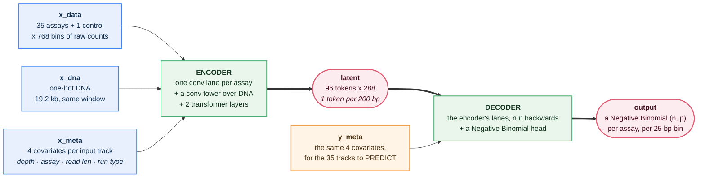
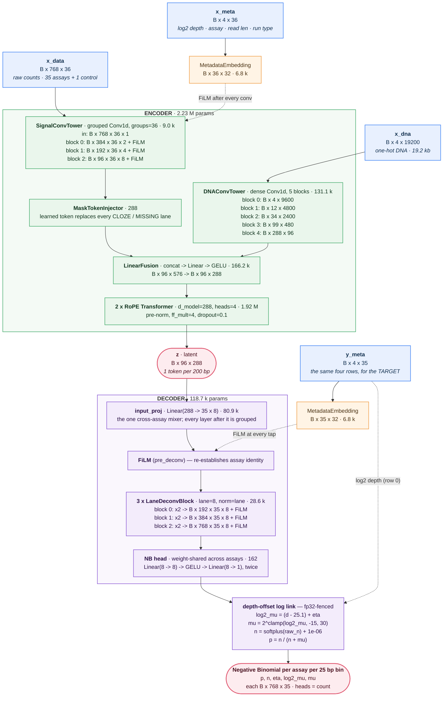
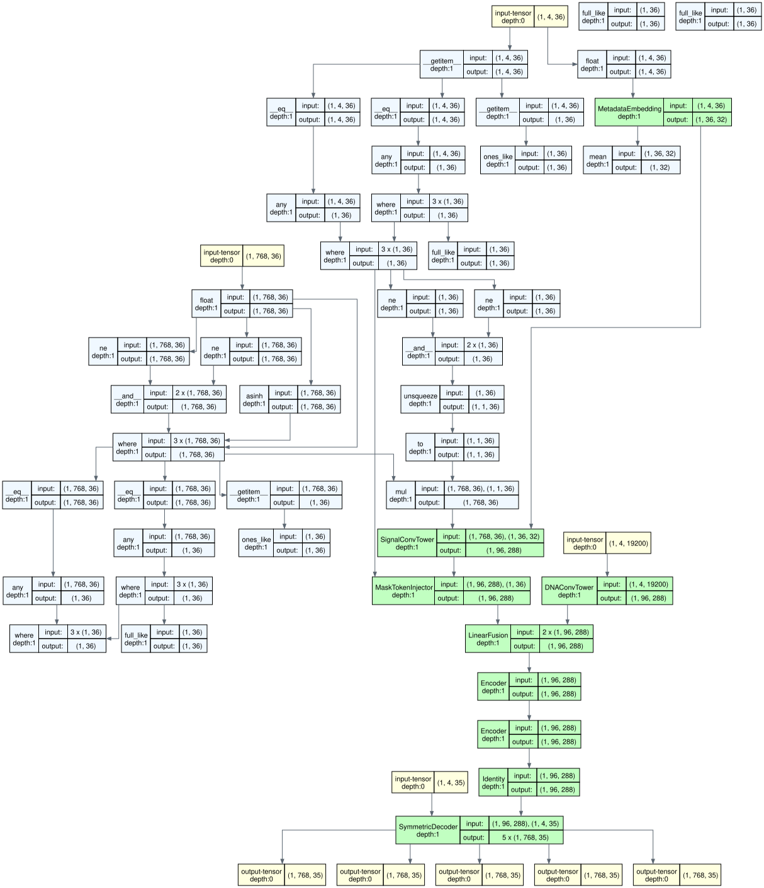

<!-- GENERATED FILE — DO NOT EDIT.
     Written by tools/arch_diagram.py from a real forward pass through build_model().
     Change a default in src/candi/model.py, then run:  python tools/arch_diagram.py build
     tests/test_arch_readme.py fails until you do. -->

# CANDI — the default architecture

Everything on this page was read off `build_model()` at its constructor defaults and off one real
forward pass through it. No number here was typed by a person, and none of it can drift: the byte
gate in [`tests/test_arch_readme.py`](../../tests/test_arch_readme.py) fails the suite the moment
the model and this page disagree.

**2,353,634 parameters.** Per assay, per 25 bp bin, CANDI emits a Negative
Binomial `(n̂, p̂)` over raw counts, conditioned on four experimental covariates on the input side
*and* on the output side. That two-sided conditioning is what makes zero-shot imputation and
denoising on an unseen cell type possible.

```
  x_data  B x 768 x 36
  x_dna   B x 4 x 19200
  x_meta  B x 4 x 36
  y_meta  B x 4 x 35
   -> `p`, `n`, `eta`, `log2_mu`, `mu`
      each B x 768 x 35
```

## At a glance

Four boxes: everything you have goes into an encoder, becomes one latent per 200 bp, and a decoder
turns that back into a distribution over counts. `y_meta` is the ask — it names which tracks to
predict and at what sequencing depth, and it enters at the *decoder*, which is why the same trained
model can be pointed at an assay it never saw in this cell type.



## The same model, with the detail left in

Channel widths, sequence lengths, parameter counts per part, and every FiLM tap. Both diagrams are
rendered from the same `arch.json`, so they cannot disagree with each other or with the model.



## Why the shapes are what they are

The whole model is one downsample and one upsample of the same factor, and the two are checked
against each other in the constructor before a single module is built.

- **`2^3` down, `2^3` up.** 768 bins in, 96 latent tokens, 768 bins out.
  A mismatch is a `ValueError` naming both flags, not a shape error inside a deconv.
- **The signal tower is grouped by track** (`groups = 36`), so an assay's channels never mix with
  another's. The lane view at each rung, asserted against a live forward pass by
  `tests/test_lane_view.py`:
  `[B, 768, 36, 1]` → `[B, 384, 36, 2]` → `[B, 192, 36, 4]` → `[B, 96, 36, 8]` — that is `[B, bins, tracks, channels-per-track]`.
- **The DNA tower's pooling is derived, never chosen.** Two of its 5 blocks pool by
  `isqrt(25) = 5` so that exactly 25 bp collapse into one bin. A resolution
  that is not a perfect square is refused rather than rounded.
- **`d_model` is derived**: 288, the signal tower’s output width.
- **The decoder is a mirror, not a trunk.** `input_proj` is the one cross-assay mixer; every layer
  after it is grouped at a constant lane width of 8, so the whole decoder costs
  118,650 parameters — 5.0% of the model. The ungrouped decoder this replaced ran a
  dense conv trunk instead and held the large majority of the parameters on its own.

## Where the conditioning enters

`film_taps` is a single set naming every place FiLM may enter, on both towers. The encoder's
`film_mode` enum is *derived* from it, so "where is the conditioning?" has one answer.

| tap | default | where it sits |
|---|---|---|
| `pre_conv` | off | encoder — once, on the signal before the conv tower |
| `per_conv` | **on** | encoder — after every conv block |
| `post_conv` | off | encoder — once, after the whole conv tower |
| `per_transformer` | off | encoder — before every transformer layer |
| `pre_deconv` | **on** | decoder — after `input_proj`, before the first deconv |
| `per_deconv` | **on** | decoder — after every deconv block |
| `post_head` | off | decoder — on `eta` and `raw_n` after the heads |

Encoder FiLM is initialised `xavier`, decoder FiLM `zero` — a zero-initialised tap is an exact
identity at step 0, which is what lets a new tap be switched on without re-sampling the model.

## The head

`heads = count`. The optional `signal` and `peak` heads are not constructed by default, own no
parameters, and add no keys to the output dict. The count head's arithmetic runs as one fp32-fenced
block, because `log2_mu` is an exponent and every bit lost there is a multiplicative error on `mu`:

```
log2_mu = (d - 25.1) + eta        # d = log2 depth; falls back to eta on a sentinel
log2_mu = log2_mu + log_ref        # only when a reference track is supplied
mu      = 2 ** clamp(log2_mu, -15, 30)
n       = softplus(raw_n) + 1e-06
p       = n / (n + mu)
```

Telling the model a different sequencing depth therefore *scales* the prediction, rather than making
it relearn scale.

## Where the parameters are

| module | params | share |
|---|---:|---:|
| `encoder.metadata_embedding` | 6,848 | 0.3% |
| `encoder.signal_tower` | 8,988 | 0.4% |
| `encoder.mask_injector` | 288 | 0.0% |
| `encoder.dna_tower` | 131,148 | 5.6% |
| `encoder.fusion` | 166,176 | 7.1% |
| `encoder.transformer_blocks` | 1,921,536 | 81.6% |
| `decoder.input_proj` | 80,920 | 3.4% |
| `decoder.blocks` | 28,608 | 1.2% |
| `decoder.film_layers` | 2,112 | 0.1% |
| `decoder.head_eta` | 81 | 0.0% |
| `decoder.head_n` | 81 | 0.0% |
| `decoder.meta_embedding` | 6,848 | 0.3% |
| **total** | **2,353,634** | **100.0%** |

The single largest part is `encoder.transformer_blocks`, at 81.6% of the weights. One window of 768 bins costs
**116 M multiply-adds** at batch 1, 9.4 MB of fp32 weights and
39 MB of activations — the last of those scales with batch size and is what
`--precision bf16` halves.

## Every architecture flag, at its default

These are the keyword defaults of `CandiModel.__init__`, which `build_model_from_arch()` reads back
out of a run's own JSON so a checkpoint stays scorable forever. `num_assays` and `context_length`
come from the panel at train time; the rest are the model's own.

| flag | default |
|---|---|
| `embed_dim` | `32` |
| `dropout` | `0.1` |
| `decoder_lane` | `8` |
| `depth_center` | `25.1` |
| `use_offset` | `True` |
| `num_assays` | `35` |
| `context_length` | `768` |
| `d_model` | `0` |
| `nhead` | `4` |
| `n_transformer_layers` | `2` |
| `num_cells` | `0` |
| `meta_embed_layernorm` | `True` |
| `meta_gain` | `1.0` |
| `deconv_norm` | `lane` |
| `resolution` | `25` |
| `n_cnn_layers` | `3` |
| `conv_kernel_size` | `3` |
| `pool_size` | `2` |
| `expansion_factor` | `2` |
| `n_deconv_layers` | `3` |
| `deconv_upsample` | `2` |
| `deconv_kernel_size` | `3` |
| `conv_norm` | `layer` |
| `transformer_norm` | `layer` |
| `transformer_norm_placement` | `pre` |
| `attn_qk_norm` | `False` |
| `film_taps` | `per_conv,pre_deconv,per_deconv` |
| `film_init_encoder` | `xavier` |
| `film_init_decoder` | `zero` |
| `head_sharing` | `shared` |
| `head_hidden` | `0` |
| `heads` | `count` |

## The traced graph, and the layer table

<details>
<summary><b>torchview</b> — the computation graph, traced from the real forward pass (depth 1)</summary>



Source: [`arch/candi_graph.dot`](arch/candi_graph.dot). The DOT is what the gate compares; the SVG is
a picture of it, and graphviz's layout is only stable within one version.

The tall run of `_eq` / `any` / `where` / `full_like` nodes above the coloured modules is real, not
noise: `CandiModel.forward` calls `encoder.encode(...)` rather than `encoder(...)`, so `V2Encoder`
never appears as a module box and the sentinel-availability bookkeeping inside `_prepare_signal`
surfaces as top-level ops. The Mermaid diagram at the top of this page is the readable view; this one
is the literal one.

</details>

<details>
<summary><b>torchinfo</b> — the layer / parameter table</summary>

See [`arch/torchinfo.txt`](arch/torchinfo.txt).

</details>

<details>
<summary><b>arch.json</b> — the machine-readable spec every artifact above is rendered from</summary>

[`arch/arch.json`](arch/arch.json) carries the flag defaults, the derived geometry, the parameter
census, and every one of the 193 modules the default model owns with its class, its parameter
count and its traced output shape. A refactor deep inside a tower shows up as a diff here.

</details>

## Regenerating

```bash
python tools/arch_diagram.py build     # rewrite this page and everything under arch/
python tools/arch_diagram.py check     # what the test runs: exit 1 if anything is stale
```

Needs the `test` extra (`pip install -e '.[test]'`) and graphviz's `dot` on PATH.
